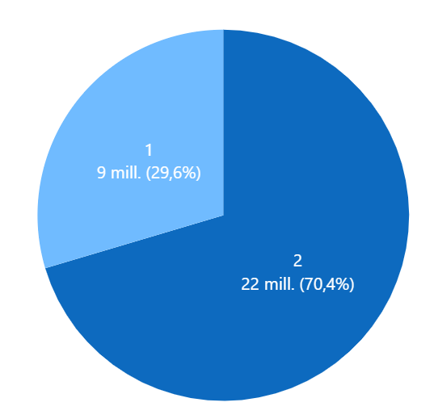
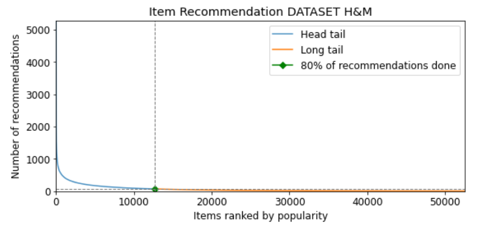

# AIDL21: Recommender Systems with GCN

This repository contains different machine learning models, such as FM, GCN and GAT, that are commonly used to implement personalized Recommender Systems. It consists of a first part to explain, in a theoretical manner, the main characteristics of this type of systems, as well as a second part with a set of detailed steps on how to run the program.

Our project aims to compare the different models and evaluate how well they perform in making recommendations, in this case focusing on a real example from the fashion industry. In order to do this, for each of them, we will measure some metrics (HR, NDCG, Coverage, etc...) that are frequently used in this kind of systems.

Finally, we will perform a detailed analysis of the obtained results in order to detect and assess possible biases. 

### About
Final Project for the UPC [Artificial Intelligence with Deep Learning Postgraduate Course](https://www.talent.upc.edu/ing/estudis/formacio/curs/310402/postgraduate-course-artificial-intelligence-deep-learning/) 2021-2022 online edition, authored by:

* [Bernat Ribes](https://www.linkedin.com/in/bernat-ribes-garcia-247338a0/)
* [Sonia Sánchez](https://www.linkedin.com/in/sosanchez/)
* [Miguel Canals](https://www.linkedin.com/in/mknals/)

Advised by [Paula Gómez](https://www.linkedin.com/in/paulagd-1995/)

## Table of Contents 

- [1. Introduction](#1-intro)
    - [1.1. Motivation](#11-motivation)
    - [1.2. Objectives](#12-milestones)
- [2. H&M Dataset](#2-available-datasets)
    - [2.1. Data Description](#21-eda)
    - [2.2. Pre-processing](#22-preprocessing) 
- [3. Models](#3-models)    
    - [3.1. Evaluation Metrics](#31-metrics)
    - [3.2. Experiment Methods & Test Strategy](#32-experimenttest)
    - [3.3. Machine Learning Models](#33-ML)
        - [Random](RAND)
        - [Popularity](POP)
        - [FM with regular embeddings](FM)
        - [FM with GCN embeddings](FMGCN)
        - [FM with GAT embeddings](FMGAT)
    - [3.3. Adding context](#32-efficientnet) 
- [4. Environment Requirements](#4-envs)
    - [4.1. Software](#41-software)
    - [4.2. Hardware](#42-hardware)
- [5. How to run the program](#5-program) 
- [6. Results](#6-results)
    - [6.1. Results 10k Customers (Random Sampling TestSet)](#61-results10K)
    - [6.2. Results 10k Customers (Full)](#62-results10KF)
    - [6.3. Results 80k Customers (Full)](#63-results80K)
    - [6.4. Model Comparison](#64-comparison)
- [7. Conclusions](#7-conclusions) 
- [8. Acknowledgements](#8-acknowledgements)
 
## 1. Introduction 

Nowadays Recommender Systems have become a key peace to solve the problem of overload information. The information if far for being reduced, as well as the diversity of users that uses platform such as  Netflix, wirh more than 17.000 titles and 221.64 million of paying subscriptions, or Amazon, with116.44 billion U.S. dollars sales and more than 200 million Prime members.

But what makes a recommender a good recommender? It is not only a question of personalizing the recommendations in such a way that the system shows the user items related to their tastes, but also of reflecting the diversity in a fair way, so that users can discover new things that may interest them and, at the same time, the systems ensure that no bias or, worse, discrimination is added.

Of course, some items are popular for a reason, so it is important to find a trade-off between accuracy & fairness.

### 1.1. Motivation 

In this project we have compared differents methods and models to make  recommendations and we have tried to find out which of them gives  more balanced results in terms of hits and fairness, reducing the popularity bias without damaging the quality of the ranking.

### 1.2. Objectives 

The main purpose of this project is to test the potencial of deep neural networks to solve the problem of personalize recommendations, in particular the use of Graph convolutional networks and Graph attention networks and to analyze how to popularity bias affect  each model.  To be more specific, the main objectives are the following:
- Find a complete dataset that fits the task. In this case we opted for an H&M dataset.
- Explore and undestand the data, clean and pre-process it to be used for training and test our models.
- Implement different simple models as Random and Popularity to have a reference.
- Implement a Factorization Machine with regular embeddings and after add embeddings generated by an GCN and GAT and analyze the results.
- Explore the Popularity Bias and analyze how it affects each model.
- Carried out some experiments adding more data expecting improvements in the results.
- Add some features related to the contexto of the transaction a evaluate how each model results are affected.
- Extract conclusions and insights from the results and visualize them in an understandable way.

## 2. H&M Dataset 

For training and testing our models, we have used the dataset provided by Kaggle competition [H&M Personalized Fashion Recommendations
](https://www.kaggle.com/c/h-and-m-personalized-fashion-recommendations).

H&M Group is a family of brands and businesses with 53 online markets and approximately 4,850 stores. In this competition, H&M Group invited users to develop product recommendations based on data from previous transactions, as well as from customer and product meta data. The available meta data spans from simple data, such as garment type and customer age, to text data from product descriptions, to image data from garment images.

H&M dataset contains data from all the transactions that took place during 2018-2020 period, as well as some costumer and article metadata, including images of all the involved products.

### 2.1. Data Description  

H&M dataset is divided into several different files:
- articles.csv - detailed metadata for each article_id available for purchase
- customers.csv - metadata for each customer_id in dataset
- transactions_train.csv - training data, consisting of the purchases each customer for each date, as well as additional information (i.e. channel).

|             Dataset features      | | 
|:------------------------:|:-------:|
|Number of articles    | 105.542|
|Number of costumers                | 1.371.980|
|Number of transactions  | 31.788.324|
|Data range  | From 2018 to 2020 |

As a result of a preliminary analysis of the dataset, we have observed the following characteristics:

· Higher accumulation of younger costumers:

  

· Quite uniform distribution in transactions grouped by costumer's age:

  

· Non-uniform distribution in transactions grouped by product category:

  

· Non-uniform distribution in transactions grouped by product color:

  

 
 · Predominant channel (2) for the articles purchase:

  

### 2.2. Pre-processing   

Due to computational limitations, we have decided to apply a series of different filters in order to reduce the number of transactions:

- Articles that have been purchased more than 5 times
- Customers who have bought more than 20 articles
- Reduce data range for the last year
- Shuffle & pick N customers (10K and 80K in our study case)

These values can be modified in any time by following the steps defined in: [1.2. Objectives](#12-milestones)

Results after applying data filtering:

|             Filtered Dataset features - 10K      | | 
|:------------------------:|:-------:|
|Number of articles    | 38.782|
|Number of costumers                | 10.000|
|Number of transactions  | 489.710|
|Data range  | 2020|

|             Filtered Dataset features - 80K      | | 
|:------------------------:|:-------:|
|Number of articles    | 52.661|
|Number of costumers                | 80.000|
|Number of transactions  | 3.990.745|
|Data range  | 2020|

After doing some analysis of the resulting data, we have computed the long-tail graph to show the distribution of popularity among articles in the dataset (for both 10K and 80K customers).

  

Products on left side (or in blue line) are called as popular because their popularity is higher then those in yellow or long-tail area. Moreover, popular products are generally competitive products. On the other hand, products in yellow long-tail area are thought to be unpopular or new products in market. The threshold which discriminates the popular and unpopular items in market is an hyper-parameter for the retailer. 

As it can be seen, it appears that our H&M dataset has some popularity bias since very few articles occupy nearly 80% of the total transactions.

`Short Head: 12.667 articles 24.10% (80%) - Max Ranking 5283 votes`
                                                       
## 3. Models 

Under this section we present all the different models that we have used for implementing the Recommender Systems, as well as the different evaluation metrics that we have measured in order to compare their performance.

### 3.1. Evaluation Metrics  

We have implemented different types of metrics, that are popular in the Recommender systems field, in order to evaluate model performance in terms of accurracy and fairness. All the metrics have been calculated taking into account a model that provides the TOPK article recommendations, where K in our case is 10. We have considered this approach since we are interested in evaluating the quality of the top recommendations.

- #### HIT RATIO (HR)

In Recommender settings, the Hit Ratio can be described as the fraction of users for which the correct answer is included in the recommendation list of length TOPK. The larger TOPK is, the higher HR becomes. [Source](https://towardsdatascience.com/ranking-evaluation-metrics-for-recommender-systems-263d0a66ef54)

- #### Normalized Discounted Cumulative Gain (NDCG)

NDCG is also commonly used as a measure of ranking quality, since it takes into account the position where articles have been recommended in the TOPK list. The idea of DCG is that highly relevant articles appearing lower in a recommendations list should be penalized, and relevance value is reduced logarithmically proportional to the position of the result. NDCG is computed as the normalization of DCG score by IDCG, delimiting its value between 0 and 1 regardless of the length. [Source](https://towardsdatascience.com/ranking-evaluation-metrics-for-recommender-systems-263d0a66ef54)

- #### COVERAGE

Coverage can be described as the percentage of articles in the training dataset that the model has been able to cover when computing the TOPK recommendations for all the users of the test dataset.

- #### GINI

Gini index is commonly used to to assess the diversity of the recommendations. The Gini coefficient is defined based on the Lorenz curve, that plots the percentiles of the items on the graph's horizontal axis according to the number of recommendation (or purchases). The cumulative recommendations/purchases is plotted on the vertical axis. An index value of 1 means that a single item is being recommended to all users, where a value of 0 means that all items are recommended equally to all the users.  [Source](https://www.researchgate.net/figure/The-Lorenz-curve-and-Gini-coefficient_fig3_242258189)

  

In our case study, we will try to adjust the recommendation algorithm in order to increase the coverage of products and improve the distribution of article recommendations.

- #### NOVELTY

To evaluate the novelty we use the mean self-information (MSI) also call Surprise. The intuition behind quantifying information is the idea of measuring how much surprise there is in an event. Those events that are rare (low probability) are more surprising and therefore have more information than those events that are common (high probability). [Source](https://machinelearningmastery.com/what-is-information-entropy/)

Low Probability Event: High Information (surprising).
High Probability Event: Low Information (unsurprising).

Information will be zero when the probability of an event is 1.0 or a certainty there is no surprise.
We calculate it as `-log(p(i))` where p(i) is popularity of the item. [Source](https://digibuo.uniovi.es/dspace/bitstream/handle/10651/50960/diez2018.pdf?sequence=1)

- #### Measure Assessment

Measure | Bar | 
:------: | :------:|
HIT RATIO   |The higher the better, more accuracy  | 
NDCG   |The higher the better, meaningful results first    | 
COVERAGE |The higher the better, more items recommended  |  
GINI   |The lower the better, more equity    |
NOVELTY |The higher the better, less popular items included in the recommendations   |

### 3.2. Experiment Methods & Test Strategy  
Our experiments are based on <b>offline testing</b>. We use implicit feedback, where the purchases of each user are available as positive items, while all non-interacted items are considered as negative.

In order to have a faster training and reduce its computational cost, we have opted for using a <b>random sampling</b> approach to build the target test datasets. As some papers pointed out that by using this method the ranking(comparison) of the models could not be estable, we have tested them with all the items included in the training dataset as target (except the interactions of each user) in order to compare the results and verify that our ranking and relation among metrics of models remains equal. Since it was the case, we have decided to mantain this strategy for the rest of experiments. [Source](https://arxiv.org/pdf/2107.13045.pdf)

### 3.3. Machine Learning Models  

- [Factorization Machine](FM)

<b>Embeddings</b>

Once we have generated our train and test datasets, we need a way to personalize users (customers) and items (articles). In order to do so, embeddings are commonly used. An embedding can be described as a relatively low-dimensional space into which you can translate high-dimensional vectors. They encode different features information across some given dimensions.

Given enough data, we can train an algorithm to understand relationships between entities and automatically learn features to represent them.

<b>Matrix Factorization</b>

Our Recommender systems are based on collaborative filtering, which objective is to discover the similarities on the user’s past behavior and make predictions to the user based on a similar preference with other users. This model is then used to predict items (or ratings for items) that the user may have an interest in.

Matrix factorization is a way to generate latent features when multiplying two different kinds of entities. Collaborative filtering is the application of matrix factorization to identify the relationship between items’ and users’ entities. With the input of users’ transactions on different articles, we would like to predict whether users would like certain articles so the users can get the recommendation based on the prediction.

  

The way it works is by decomposing the rating matrix, which is the one containing all the user-item interactions, into two rectangular matrices of lower dimension whose dot product will result in the same rating matrix again. In that way, we can end up with a matrix of features for each of the users and items, which will contain the latent representation of each of the entities, so we will have computed the embeddings.

<b>Factorization Machine</b>

Factorization Machines (FM) are a supervised Machine Learning technique introduced in 2010 [paper](https://www.csie.ntu.edu.tw/~b97053/paper/Rendle2010FM.pdf). Factorization Machines get their name from their ability to reduce problem dimensionality thanks to applying matrix factorization techniques.

  

## 4. Environment Requirements 
### 4.1. Software  

Cómo installar python
Cómo installar miniconda / setup environment
Librerias
Tabla => nombres clases q tenemos su proposito

We selected PyTorch as framwork for our scientific computing package to develop our project. Regarding the image transformations used for standard augmentations, we have selected both Torchvision and Albumentation packages. To approach the imbalance dataset issue we used Torchsampler’s Imbalanced Dataset Sampler library. For visualization, we also used both classical Pyplot and Seaborn packages. For the dataset preprocessing, we made use of the modules available in Scikit-Learn library. Some of the GANs-based implementations developed make use of YAML as the preferred language for defining its configuration parameters files. Lastly, the package Pytorch Image Quality Assessment (PIQA) is used to generate the metrics that evaluate the quality of the synthetic images. And finally, for the model we made use of lukemelas EfficientNet architecture. 
 

### 4.2. Hardware   

The GANs were trained using Google Colab. This work environment provided us an easy way to work in teams and to access to GPUs. The Classifier also started as a Google Colab project, however, due to its high computing demands, we were forced to port it to Google Cloud to avoid the time limit of the Colab.  

- **Google Cloud Platform**

To launch the instance we used Cloud Deep Learning VM Image. We created a Linux VM, with a n1-highmem-2 machine and 1 NVIDIA Tesla k80 GPU. In addition to the Instance, we created a bucket in order to upload the Images from the different datasets (the reduced one, and the ones with the GANs) to then move them to the persistent disk. We firstly implemented our code using the Jupyter Notebook function, but since the training process took a long time and Google Cloud Shell would eventually log off, we switched to SSH and launched our script from the terminal.

## 6. Results 
### 6.1 Results 10K Customers (Random Sampling Test Set) 

|Model | HR@10 | NDCG@10 |COV@10 |GINI@10 |NOV@10 |COMPUTATIONAL REQUIREMENTS|
:------: | :------:| :------:| :------:| :------:|:------:|:-----------------:|
|Random | 10,33%	|4,76%|92,60%|0,3397|11,3275|	LOW|
|Popularity |39,61%|22,33%|16,42%|0,9006|7,821|LOW|
|FM |20,22%|10,44%|34,42%|0,8525|9,995|LOW|
|FM+Context |36,88%|20,42%|26,51%|0,8448|8,7726|LOW|
|FM + GCN  |36,11%|20,77%|50,97%|0,7351|10,1138|MEDIUM|
|FM + GAT |39,27 %|23,17 %|49,98 %|0,7575|9,1396|VERY HIGH|

The Random Model of course shows the best results regarding the fairness but the accuracy metrics are very poor. Popularity Model has the better results related to accuracy but obviously has bias. The more balanced one is FM+GAT Model than performance better in all the metrics than the rest.

### 6.2 Results 10K Customers (Full) 

|Model | HR@10 | NDCG@10 |COV@10 |GINI@10 |NOV@10 |COMPUTATIONAL REQUIREMENTS|
:------: | :------:| :------:| :------:| :------:|:------:|:-----------------:|
|Random | 0,00%|0,00%|92,60%|0,3404|11,335|LOW|
|Popularity |1,01%|0,49%|0,04 %|0,9997|4,811|LOW|
|FM |0,15%|0,70%|7,29 %|0,9957|9,327|LOW|
|FM + GCN  |1,03%|0,58%|6,49 %|0,9926|8,465|MEDIUM|
|FM + GAT |2,20 %|1,46%|17,65 %|0,9739|8,465|VERY HIGH|

The test on all elements of the training set helps us put the numbers in context and see them in some perspective.
The ranking of the models does not change much and the relationship between metrics is maintained, but the popularity model shows a greater bias.

### 6.3 Results 80K Customers (Random Sampling Test Set) 

|Model | HR@10 | NDCG@10 |COV@10 |GINI@10 |NOV@10 |COMPUTATIONAL REQUIREMENTS|
:------: | :------:| :------:| :------:| :------:|:------:|:-----------------:|
|Random |9,97 %|4,53 %|	100%|0,1456|12,2173|LOW|
|Popularity |47,61 %|27,04 %|18,92 %|0,8978|8,0931|LOW|
|FM |31,38 %|15,98 %|51,33 %|0,8464|9,5201|LOW|
|FM + Context |53,24%|29,99%|39,91%|0,8312|8,6605|LOW|
|FM + GCN  |59,59 %|36,02 %|64,10 %|0,7615|9,1412|MEDIUM|
|FM + GAT |Not feasible|	Not feasible|	Not feasible|	Not feasible|	Not feasible|	VERY HIGH|

It has not been possible to compute the FM+GAT model with this dataset due to the memory and gpu requirements it required, although the results would most likely have been better than the rest. Anyway FM + GCN improve all the metrics by adding more data. Also is important to mention than by adding the sales channel as context information in the embeddings with the FM Model, improves a lot the results obtained by FM. 

  <table>
    <tr><td>
         
 <b>Random    </b>

         

         
         

        </td>
        <td>
         
<b>Popularity </b>

         

         
         

        </td>
      </tr>
      <tr><td>
         
 <b>Factorization Machine</b>

         

         
         

        </td>
        <td>
         
<b>Factorization Machine + Context </b>

         

         
         

        </td>
      </tr>
       <tr><td>
         
 <b>Factorization Machine + GCN</b>

         

         
         

        </td>
       </tr>
  </table>

### 6.4 Model Comparison    

  <table>
    <tr><td>
         
 <b>Radar Chart    </b>

         

         
         

        </td>
      </tr>
   </table>
  

  
## 7. Conclusions 

* The results of the **FM+GAT** model were promising with a small dataset, but it has not been possible to test it with a larger one due to the computational resources it required.

* **FM+GCN** Model give a good and balanced resulto, much better than Popularity Model.

* **Popularity** Model is a very cheap model with not so bad performance in terms of accuracy.

* By adding **extra features** to the FM Model we observed an evident improvements in the metrics so we guess that doing the same for FM+GCN and FM+GAT will allow to have a very good results in all the metrics.

* Our original dataset had a distribution with an obvious **popularity bias** ,inherent to fashion, and for this reason it is difficult to obtain better results in terms of **Gini and Novelty** if other strategies are not used, such as performing a subsequent reranking including more items belonging to the long tail or using a hybrid recommender always taking into account the users preferences.

* The selection and interpretation of metrics to mesure the **Fairness** has not been easy.

## 8. Acknowledgements 

We would like to thank all the teachers from the Prostgraduate Course on Artificial Intelligence with Deep Learning. It has been a hard but amazing journey.

It is also fair to mention and appreciate the amount of articles and code available through the Internet, shared knowledge is the best way to progress.

Finally, we would also thanks our families for its patient and support during this months.
