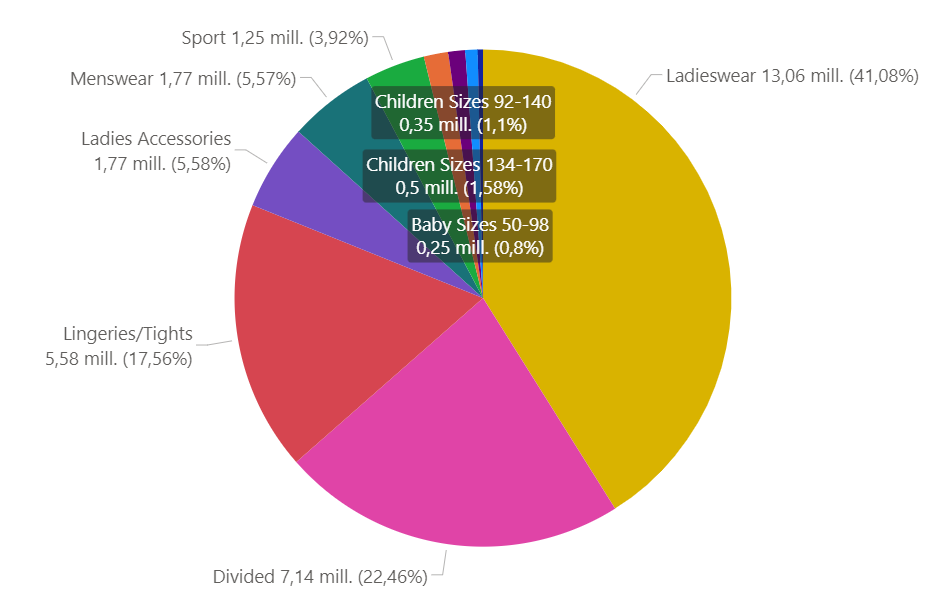
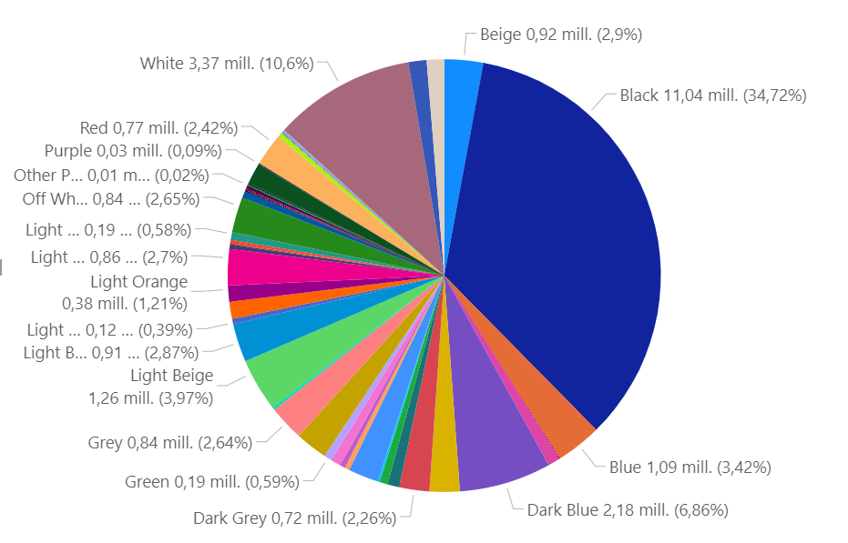

# AIDL21: Recommender Systems with GCN

This repository contains different machine learning models implementations, such as FM, GCN and GAT, that are commonly used to build personalized Recommender Systems. It consists of a first part that explains, in a theoretical manner, the main characteristics of this type of systems, as well as a second part with a set of detailed steps on how to run the program.

Our project aims to understand and compare the different models and evaluate how well they perform in making recommendations, taking as a example a real case study from the fashion industry. In order to do this we will measure some metrics for each of them (HR, NDCG, Coverage, etc...) that are frequently used in this type of systems.

Finally, we will perform a detailed analysis of the obtained results in order to detect and assess possible biases. 

### About
Final Project for the UPC [Artificial Intelligence with Deep Learning Postgraduate Course](https://www.talent.upc.edu/ing/estudis/formacio/curs/310402/postgraduate-course-artificial-intelligence-deep-learning/) 2021-2022 online edition, authored by:

* [Bernat Ribes](https://www.linkedin.com/in/bernat-ribes-garcia-247338a0/)
* [Sonia Sánchez](https://www.linkedin.com/in/sosanchez/)
* [Miguel Canals](https://www.linkedin.com/in/mknals/)

Advised by [Paula Gómez](https://www.linkedin.com/in/paulagd-1995/)

## Table of Contents <a name="toc"></a>

- [1. Introduction](#1-intro)
    - [1.1. Motivation](#11-motivation)
    - [1.2. Objectives](#12-milestones)
- [2. H&M Dataset](#2-available-datasets)
    - [2.1. Data Description](#21-eda)
    - [2.2. Pre-processing](#22-preprocessing) 
- [3. Models](#3-models)    
    - [3.1. Evaluation Metrics](#31-metrics)
    - [3.2. Experiment Methods & Test Strategy](#32-experimenttest)
    - [3.3. Machine Learning Models](#33-ML)
        - [Factorization Machine](#331-FM)
        - [Graph Convolutional Networks](#332-GCN)
        - [Graph Attention Networks](#333-GAT)
        - [Random](#334-RAND)
        - [Popularity](#335-POP)
- [4. Environment Requirements](#4-requirements)
    - [4.1. Software](#41-software)
    - [4.2. Hardware](#42-hardware)
- [5. Running the code](#5-running)
    - [5.1. Dataset creation](#51-dataset)
    - [5.2. Model execution withour features](#52-models-nofeat)
        - [5.2.1 Random model](#521-models-nofeat-random)
        - [5.2.2 Popularity model](#522-models-nofeat-poularity)
        - [5.2.3 Factorization Machines model](#523-models-nofeat-FM)
        - [5.2.4 Factorization Machines model](#524-models-nofeat-GCN)
        - [5.2.5 Factorization Machines with GCN and attention](#525-models-nofeat-GCN-ATT)
    - [5.3. Model execution with features](#53-models-feat)
        - [5.3.1 Random model](#531-models-feat-FM)
- [6. Results](#6-results)
    - [6.1. Results 10k Customers (Random Sampling TestSet)](#61-results10K)
    - [6.2. Results 10k Customers (Full)](#62-results10KF)
    - [6.3. Results 80k Customers (Full)](#63-results80K)
    - [6.4. Model Comparison](#64-comparison)
    - [6.5. Reports](#65-reports)
- [7. Conclusions](#7-conclusions) 
- [8. Acknowledgements](#8-acknowledgements)
 
## 1. Introduction <a name="1-intro"></a>

Recommender Systems are a useful tool that automatizes the task of predicting the preferences of the users of a service in order to recommend them items that could match its preferences. They have become a key piece to solve the problem of overload information that we live today. Data is far from being reduced, as well as the diversity of users that use online platforms such as Netflix, with more than 17.000 titles and 221.64 million of paying subscriptions, or Amazon, with 116.44 billion U.S. dollars sales and more than 200 million Prime members.

<p align="left">
  
</p>

But what makes a recommender good? It is not only a question of personalizing the recommendations in such a way that the system shows the users items that are related to their tastes, but also of reflecting the diversity in a fair way, so that users can discover new things that may interest them and, at the same time, ensure that no bias or, worse, discrimination is added to the recommendations. Of course, some items are popular for a reason, so it is important to find a trade-off between accuracy and fairness.

<p align="left">
  
</p>

### 1.1. Motivation <a name="11-motivation"></a>

In this project we have compared differents methods and models to make recommendations in order to find out which gives more balanced results in terms of accuracy and fairness, trying to reduce the Popularity Bias without damaging the quality of the ranking.

### 1.2. Objectives <a name="12-milestones"></a>

The main purpose of this project is to learn and test the potencial of some traditional Recommender System models and understand their behaviour. In particular, we will start by detailing Factorization Machine model and extend it by introducing Graph Convolutional Networks and Graph Attention Networks to analyze and quantify its improvmement. Finally, we will create Random and Popularity models and compare the results obtained with all the models. Through the results, we will be able to evaluate how Popularity Bias affect each model. 

To be more specific, main project objectives are:
- Find a complete dataset that fits the task. In this case we opted for real dataset from H&M fashion brand.
- Explore and undestand the data, clean and pre-process it to be able to use it for training and testing our models.
- Implement different simple models such as Random and Popularity recommenders.
- Implement a Factorization Machine model with regular embeddings and extend it by adding embeddings generated by a GCN and GAT. 
- Analyze and compare the results obtained with all the models (using different types of metrics).
- Explore the Popularity Bias and analyze to what extent it affects each model.
- Carry out some experiments of adding more data to the model to see how it improves.
- Add context to the model in order to quantify its improvement in the different metrics.
- Extract conclusions and insights from the results and visualize them in an understandable way.

## 2. H&M Dataset <a name="2-available-datasets"></a>

For training and testing our models, we have used the dataset provided by Kaggle competition [H&M Personalized Fashion Recommendations
](https://www.kaggle.com/c/h-and-m-personalized-fashion-recommendations).

H&M Group is a family of brands and businesses with 53 online markets and approximately 4,850 stores. In this competition, H&M Group invited users to develop product recommendations based on data from previous transactions, as well as from customer and product meta data. The available meta data spans from simple data, such as garment type and customer age, to text data from product descriptions, to image data from garment images.

H&M dataset contains data from all the transactions that took place during 2018-2020 period, as well as some costumer and article metadata, including images of all the involved products.

### 2.1. Data Description  <a name="21-eda"></a>

H&M dataset is divided into several different files:
- articles.csv - detailed metadata for each article_id available for purchase
- customers.csv - metadata for each customer_id in dataset
- transactions_train.csv - training data, consisting of the purchases each customer for each date, as well as additional information (i.e. channel).

|             Dataset features      | | 
|:------------------------:|:-------:|
|Number of articles    | 105.542|
|Number of costumers                | 1.371.980|
|Number of transactions  | 31.788.324|
|Data range  | From 2018 to 2020 |

As a result of a preliminary analysis of the dataset, we have observed the following characteristics:

<div style="overflow-x:auto;">
  <table>
    <tr><td>
         <p align="left">Most of the costumers are young</p>
         <p align="left">
            
         </p>
        </td>
        <td>
         <p align="left">Uniform distribution of transactions grouped by costumer's age</p>
         <p align="left">
            
         </p>
        </td>
      </tr>
      <tr><td>
         <p align="left">Non-uniform distribution of transactions grouped by product category</p>
         <p align="left">
            
         </p>
        </td>
        <td>
         <p align="left">Non-uniform distribution of transactions grouped by product color</p>
         <p align="left">
            
         </p>
        </td>
      </tr>
       <tr><td>
         <p align="left">Predominant channel (2) for purchasing articles:</p>
         <p align="left">
            
         </p>
        </td>
         <td>
         <p align="left">Most of costumers do not check news:</p>
         <p align="left">
            
         </p>
        </td>
  </table>
</div>

### 2.2. Pre-processing  <a name="22-preprocessing"></a> 

Due to computational limitations, we have decided to apply a series of different filters in order to reduce the number of transactions:

- Articles that have been purchased more than 5 times
- Customers who have bought more than 20 articles
- Reduce data range for the last year
- Shuffle & pick N customers (10K and 80K in our study case)

These values can be modified in any time by following the steps defined in: [1.2. Objectives](#12-milestones)

Results after applying data filtering:

|             Filtered Dataset features - 10K      | | 
|:------------------------:|:-------:|
|Number of articles    | 38.782|
|Number of costumers                | 10.000|
|Number of transactions  | 489.710|
|Data range  | 2020|

|             Filtered Dataset features - 80K      | | 
|:------------------------:|:-------:|
|Number of articles    | 52.661|
|Number of costumers                | 80.000|
|Number of transactions  | 3.990.745|
|Data range  | 2020|

After doing some analysis of the resulting data, we have computed the long-tail graph to show the distribution of popularity among articles in the dataset (for both 10K and 80K customers).

<p align="left">
  
</p>

Products on left side (or in blue line) are called as popular because their popularity is higher then those in yellow or long-tail area. Moreover, popular products are generally competitive products. On the other hand, products in yellow long-tail area are thought to be unpopular or new products in market. The threshold which discriminates the popular and unpopular items in market is an hyper-parameter for the retailer. 

As it can be seen, it appears that our H&M dataset has some popularity bias since very few articles occupy nearly 80% of the total transactions.

`Short Head: 12.667 articles 24.10% (80%) - Max Ranking 5283 votes`
                                                       
## 3. Models <a name="3-models"></a>

Under this section we present all the different models that we have used for implementing the Recommender Systems, as well as the different evaluation metrics that we have measured in order to compare their performance.

### 3.1. Evaluation Metrics  <a name="31-metrics"></a>

We have implemented different types of metrics, that are popular in the Recommender systems field, in order to evaluate model performance in terms of accurracy and fairness. All the metrics have been calculated taking into account a model that provides the TOPK article recommendations, where K in our case is 10. We have considered this approach since we are interested in evaluating the quality of the top recommendations.

- #### HIT RATIO (HR)

In Recommender settings, the Hit Ratio can be described as the fraction of users for which the correct answer is included in the recommendation list of length TOPK. The larger TOPK is, the higher HR becomes. [Source](https://towardsdatascience.com/ranking-evaluation-metrics-for-recommender-systems-263d0a66ef54)

- #### Normalized Discounted Cumulative Gain (NDCG)

NDCG is also commonly used as a measure of ranking quality, since it takes into account the position where articles have been recommended in the TOPK list. The idea of DCG is that highly relevant articles appearing lower in a recommendations list should be penalized, and relevance value is reduced logarithmically proportional to the position of the result. NDCG is computed as the normalization of DCG score by IDCG, delimiting its value between 0 and 1 regardless of the length. [Source](https://towardsdatascience.com/ranking-evaluation-metrics-for-recommender-systems-263d0a66ef54)

- #### COVERAGE

Coverage can be described as the percentage of articles in the training dataset that the model has been able to cover when computing the TOPK recommendations for all the users of the test dataset.

- #### GINI

Gini index is commonly used to to assess the diversity of the recommendations. The Gini coefficient is defined based on the Lorenz curve, that plots the percentiles of the items on the graph's horizontal axis according to the number of recommendation (or purchases). The cumulative recommendations/purchases is plotted on the vertical axis. An index value of 1 means that a single item is being recommended to all users, where a value of 0 means that all items are recommended equally to all the users.  [Source](https://www.researchgate.net/figure/The-Lorenz-curve-and-Gini-coefficient_fig3_242258189)

<p align="left">
  
</p>

In our case study, we will try to adjust the recommendation algorithm in order to increase the coverage of products and improve the distribution of article recommendations.

- #### NOVELTY

To evaluate the novelty we use the mean self-information (MSI) also call Surprise. The intuition behind quantifying information is the idea of measuring how much surprise there is in an event. Those events that are rare (low probability) are more surprising and therefore have more information than those events that are common (high probability). [Source](https://machinelearningmastery.com/what-is-information-entropy/)

Low Probability Event: High Information (surprising).
High Probability Event: Low Information (unsurprising).

Information will be zero when the probability of an event is 1.0 or a certainty there is no surprise.
We calculate it as `-log(p(i))` where p(i) is popularity of the item. [Source](https://digibuo.uniovi.es/dspace/bitstream/handle/10651/50960/diez2018.pdf?sequence=1)

- #### Measure Assessment

Measure | Bar | 
:------: | :------:|
HIT RATIO   |The higher the better, more accuracy  | 
NDCG   |The higher the better, meaningful results first    | 
COVERAGE |The higher the better, more items recommended  |  
GINI   |The lower the better, more equity    |
NOVELTY |The higher the better, less popular items included in the recommendations   |

### 3.2. Experiment Methods & Test Strategy  <a name="32-experimenttest"></a>
Our experiments are based on <b>offline testing</b>. We use implicit feedback, where the purchases of each user are available as positive items, while all non-interacted items are considered as negative.

In order to have a faster training and reduce its computational cost, we have opted for using a <b>random sampling</b> approach to build the target test datasets. As some papers pointed out that by using this method the ranking (comparison) of the models could not be estable, we have tested them with all the items included in the training dataset as target (except the interactions of each user) in order to compare the results and verify that our ranking and relation among metrics of models remained equal. Since it was the case, we have decided to mantain this strategy for the rest of experiments. [Source](https://arxiv.org/pdf/2107.13045.pdf)

### 3.3. Machine Learning Models  <a name="33-ML"></a>

### Factorization Machine <a name="331-FM"></a>

<b>Embeddings</b>

Once we have generated our train and test datasets, we need a way to personalize users (customers) and items (articles). In order to do so, embeddings are commonly used. An embedding can be described as a relatively low-dimensional space into which you can translate high-dimensional vectors. They encode different features information across some given dimensions.

Given enough data, we can train an algorithm to understand relationships between entities and automatically learn features to represent them.

<b>Matrix Factorization</b>

Our Recommender systems are based on collaborative filtering, which objective is to discover the similarities on the user’s past behavior and make predictions to the user based on a similar preference with other users. This model is then used to predict items (or ratings for items) that the user may have an interest in.

Matrix factorization is a way to generate latent features when multiplying two different kinds of entities. Collaborative filtering is the application of matrix factorization to identify the relationship between items’ and users’ entities. With the input of users’ transactions on different articles, we would like to predict whether users would like certain articles so the users can get the recommendation based on the prediction.

<p align="left">
  
</p>

The way it works is by decomposing the rating matrix (adjacency matrix), which is the one containing all the user-item interactions, into two rectangular matrices of lower dimension whose dot product will result in the same rating matrix again. In that way, we can end up with a matrix of features for each of the users and items, which will contain the latent representation of each of the entities, so we will have computed the embeddings.

<b>Factorization Machine</b>

Factorization Machines (FM) are a supervised Machine Learning technique introduced in 2010 [paper](https://www.csie.ntu.edu.tw/~b97053/paper/Rendle2010FM.pdf). Factorization Machines get their name from their ability to reduce problem dimensionality thanks to applying matrix factorization techniques.

<p align="left">
  
</p>

In our study case, we will be evaluating Factorization Machine with and without context. When adding context, we will be considering the channel where the transaction has been done. In that sense, our rating matrix (adjacency) would look like:

<p align="left">
  
</p>

Prior to the test, we will be generating a number of <b>negative samples</b> in order to have test cases where we know that the user has not bought that particular article, so we can make a better evaluation of the model's performance.

Finally, we will be computing Factorization Machine with regular embeddings as well as using Graph Convolutional Networks to extend this model so they can capture high-order interactions between features.

Expected behaviour:

|Hit Ratio|NDCG|Coverage|Gini Index|Novelty (MSI)|Computational resources| 
|------:|-------:|----------------:|--------------:|--------------:|-------------:|
|Medium|Medium|Medium|Medium|Medium|Medium|

### Graph Convolutional Networks <a name="332-GCN"></a>

Factorization Machines add some side information to the possible interactions through extending the feature vectors, which may provoke a very high number of parameters, specially when adding different features. Graph Convolutional Networks helps to address this problem by making use of Knowledge Graphs to represent the available data, since it is an easier way to consider more entities involved in the interactions.

In order to identify rating patterns on the graph, we use Graph Convolutional Networks, that perform convolutions on the graph in the same way that Convolutional Neural Networks do on images. They work by assuming that connected nodes tend to be similar and share labels and they enable us to identify high-order
interactions between features.

GCNs take as an input:
- A Feature Matrix X (n×d) where n is the number of nodes and d is the number of features per node. Every row of it represents a description in d features of one of the nodes.
- A matrix A (n×n) called Adjacency Matrix that describes the connectivity in the graph, by specifying the edges in the graph.

They perform the following propagation rule:

<p align="left">
  
</p>
Where:
- A is the adjacency matrix.
- D is the diagonal matrix that normalizes A by taking the average of neigh-boring node features.
- Â = A + I, where I is the Identity Matrix.  This way, we add self-connections to our adjacency matrix and we will reflect the node itself
in the graph interactions.
- σ is an activation function (for example, ReLU).
- W(l) is a matrix of layer-specific trainable weights.

Expected behaviour:

| Hit Ratio   | NDCG |  Coverage |   Gini Index |  Novelty (MSI)  | Computational resources   
|------|-------:|----------------:|--------------:|--------------:|-------------:|
|High|High|Medium|Medium|Medium|High

### Graph Attention Networks <a name="333-GAT"></a>

Graph Attention Network (GAT) is a neural network architecture that operates on graph-structured data, leveraging masked self-attentional layers to address the shortcomings of prior methods based on graph convolutions or their approximations. By stacking layers in which nodes are able to attend over their neighborhoods’ features, the method enables (implicitly) specifying different weights to different nodes in a neighborhood, without requiring any kind of costly matrix operation (such as inversion) or depending on knowing the graph structure upfront.

GAT helps to assess one of the problems of GCNs, which way to aggregate messages is structure-dependent, affecting its generalizability. Instead, GAT introduces the attention mechanism as a substitute for the statically normalized convolution operation. The figure below clearly illustrates the key difference:

<p align="left">
  
</p>

Expected behaviour:

| Hit Ratio   | NDCG |  Coverage |   Gini Index |  Novelty (MSI)  | Computational resources   
|------|-------:|----------------:|--------------:|--------------:|-------------:|
|Very high|Very high|Medium|Medium|Medium|Very high

### Random <a name="334-RAND"></a>

Popularity recommender models allows to predict any items (randomly selected) that a particular costumer has not previously purchased.

Expected behaviour:

| Hit Ratio   | NDCG |  Coverage |   Gini Index |  Novelty (MSI)  | Computational resources   
|------|-------:|----------------:|--------------:|--------------:|-------------:|
|Low|Low|High|Close to 0|High|Low

### Popularity <a name="335-POP"></a>

Popularity recommender models allows to predict most popular items (with more interactions) that a particular costumer has not previously purchased. This is the most basic recommendation system which provides generalized recommendation to every user depending on the popularity. Whatever is more popular among the general public, is more likely to be recommended to new customers. The generalized recommendation is not personalized, is based on the count.

Expected behaviour:

| Hit Ratio   | NDCG |  Coverage |   Gini Index |  Novelty (MSI)  | Computational resources   
|------|-------:|----------------:|--------------:|--------------:|-------------:|
|High|High|Low|Close to 1|Low|Low

## 4. Environment Requirements <a name='4-requirements'>

### 4.1. Software  <a name='41-software'></a>

All project has been based on python and related libraries.

In order to use a controlled environment we have used conda.

##### Miniconda

We assume python and conda are installed.
```
laika@casiopea:~$ python3 -V
Python 3.8.10
laika@casiopea:~$ conda -V
conda 4.13.0
```
Then we create the environment and active it.

```
conda create --name jupyter_geo python=3.8
conda activate jupyter_geo
```
Then we install all de required packages:

```
conda install pytorch torchvision torchaudio cudatoolkit=10.2 -c pytorch
conda install pyg -c pyg
conda install scikit-learn-intelex
conda install -c conda-forge tensorboard
conda install -c conda-forge gdown 
conda install -c anaconda jupyter 
conda install -c pytorch torchtext 
conda install -c anaconda more-itertools 
conda install -c conda-forge spacy 
conda install -c conda-forge matplotlib 
```

### 4.2. Hardware  <a name='42-hardware'></a> 

We have used Google Collab for many of the early stages of the software development. 

Once we have started more in deep work, we have used:

* Local machine -> Ubuntu - I7 machine 48 GB with 2 x 1070 RTX 8 GB GPUs

* Google Cloud Platform -> 4 GPU x Tesla T4.


## 5. Running the code <a name='5-running'></a>

As the Kaggle's original data for all the full dataset of H&M is to big, we have had to create a filtering program in order to reduce the dataset and create the input files for the model processing.

### 5.1. Dataset creation <a name="51-dataset"></a>

#### Starting point: Full Kaggle dataset

Full dataset has been download from kaggle's  ["H&M Personalized Fashion Recommendations"](https://www.kaggle.com/competitions/h-and-m-personalized-fashion-recommendations)

 
 #### Data filtering (data_filtering.py)
 
 We will assume Kaggle files will be in:
 ```
 ../data/articles.csv
 ../data/customers.csv
 ../data/transactions_train.csv
 ```
 
 The following restrictions can be set with this program:
 - As transaction data spawns from `20-Sep-2018` till `22-Sep-2020`, we can select the temporal range. For our models we have always set the initial data `2019-09-22` (program will read only dates before this one.)
 - We want to take in account articles with a minimum number of transactions (we understand that it should be a minimum threshold of the article importance. In all our models we have requested that only items with at least `5` transactions should be considered. 
 - In order to work with customers, we need them with a minimum significance. We can set the minimum number a customer must have to be take in account. We have set at least `20` transactions per customer in order to be considered in all models.
 - At the end, we have set the size of the our dataset depending the number of users to be randomly selected once the previous restrictions are set. He have used an smaller dataset with `10000` customers and a much larger of `80000` customers. 
 
These restrictions are hardcoded in the program. These lines need to be changed in the main procedure
```
ini_date= "2019-09-22" 
min_trans_per_article=5
min_trans_per_customer=20
total_customers=10000
```
The file will generate automatically a csv file with these convention:

```
../data/transactions_ddup_{ini_date}_nart_{min_art}_ncust_{min_trans}_ncustr_{customer_number}.csv
```
For example for the selected values, result file will be:

```
transactions_ddup_2019-09-22_nart_5_ncust_20_ncustr_10000.csv
```

This file is the one it will be used as data for the models.

Just to get an idea, these 2 settings will represent:

| Customers dataset | Number of items | Number of transactions|
|:-----------------:|:---------------:|:---------------------:|
|10.000| 38.200 | 401.000 |
|80.000| 52.600 | 3.272.000 |

#### Working files for models without features with `build_dataset.py`

The dataset we will be use for our models depend if there are some feature or not. First case is just without any feture.

So, we need to transform the previous filtered csv in to working files that will resemble the Movilens indexed format for all items and customers. The program that will make this conversion is `build_dataset.py`

We will need to specifiy the csv with our filtered dataset in the main procedure
```
if __name__ == '__main__':
    transactions = transactions = pd.read_csv("../data/transactions_ddup_2019-09-22_nart_5_ncust_20_ncustr_80000.csv")
```
After running the program, it will generate the working files we need to use to run the models

Customer-article transactions are sorted by users and then by date for each user. The first transaction will be used for the test dataset.

##### ../data/customer.test.article

This is the general format:
| customer_id | article_id | label| t_dat|
|:-----------:|:----------:|:----:|:----:|
|...|...|...|...|
|...|...|...|...|
|user i-1|item 1 |1|tdat 1|
|user i|item 1|1|tdat 1|
|user i+1|item 1 |1|tdat 1|
|...|...|...|...|

For example the first transaction of the first 4 users:
| customer_id | article_id | label| t_dat|
|:-----------:|:----------:|:----:|:----:|
|1	|1	|1	|20200519|
|2	|27	|1	|20200618|
|3	|63|	1	|20200613|
|4	|92|	1	|20200618|
|...|...|...|...|
|...|...|...|...|

##### ../data/customer.train.article

Train data will contain the remain transactions for each user:

| customer_id | article_id | label| t_dat|
|:-----------:|:----------:|:----:|:----:|
|...|...|...|...|
|...|...|...|...|
|user i-1|item m |1|tdat m|
|user i|item 2|1|tdat 2|
|user i|item 3||tdat 3|
|...|...|...|...|
|user i|item n |1|tdat n|
|user i+1|item 2 |1|tdat 2|
|...|...|...|...|
|...|...|...|...|

For instance for user 38:

| customer_id | article_id | label| t_dat|
|:-----------:|:----------:|:----:|:----:|
|...|...|...|...|
|...|...|...|...|
|37	|1241	|1	|20190927|
|38	|548	|1	|20200901|
|38	|1243	|1	|20200901|
|38	|1244	|1	|20200831|
|38	|1245	|1	|20200831|
|38	|551	|1	|20200831|
|38	|1246	|1	|20200831|
|...|...|...|...|
|38	|1279	|1	|20191123|
|38	|350	|1	|20191123|
|38	|1280	|1	|20191123|
|39	|1282	|1	|20200903|
|...|...|...|...|
|...|...|...|...|

##### ../data/customer.dic

This is dictionary file that will allow us to relate each indexed customer with the actual customer value in original H&M dataset. This will be use to generate our reports only.

| actual customer_id | indexed customer_id | 
|-------------------:|:------------------:|
|00011770272...3ccbb8d5dbb4b92	|1|
|00023e3dd86...e0038c6b10f655a	|2|
|0002d2ef78e...bde96e828d770f6	|3|
|0002e6cdaab...98119fa9cb3cee7	|4|
|00045027219...d9a84994678ac71	|5|
|...|...|
|...|...|

##### ../data/article.dic

This is dictionary file that will allow us to relate each indexed article with the actual article value in original H&M dataset. This will be use to generate our reports only.

| actual aticle_id | indexed article_id | 
|-------------------:|:------------------:|
|708485004|	1|
|820462009|	2|
|863456003|	3|
|570002090|	4|
|863456005|	5|
|...|...|
|...|...|


#### Working files for models with features with `build_dataset_features.py`

The dataset we will be use for our models depend if there are some feature or not. Second case is just without the sales channel value.

The program that will make this conversion is `build_dataset_features.py`

We will need to specifiy the csv with our filtered dataset in the main procedure
```
if __name__ == '__main__':
    transactions = transactions = pd.read_csv("../data/transactions_ddup_2019-09-22_nart_5_ncust_20_ncustr_80000.csv")
```
After running the program, it will generate the working files we need to use to run the models

Customer-article transactions are sorted by users and then by date for each user. The first transaction will be used for the test dataset.

##### ../data/customer.test.article.channel

This is the general format:
| customer_id | article_id | chanel_id |label| t_dat|
|:-----------:|:----------:|:----:|:----:|:----:|
|...|...|...|...|...|
|...|...|...|...|...|
|user i-1|item 1| channel 1 |1|tdat 1|
|user i|item 1|channel 1 |1|tdat 1|
|user i+1|item 1 |channel 1 |1|tdat 1|
|...|...|...|...|...|

For example the first transaction of the first 4 users:
| customer_id | article_id | label| t_dat|
|:-----------:|:----------:|:----:|:----:|
|1	|1	|1	|1	|20200519|
|2	|27	|2	|1	|20200618|
|3	|63|1	|	1	|20200613|
|4	|92|2	|	1	|20200618|
|...|...|...|...|
|...|...|...|...|

##### ../data/customer.train.article.channel

Train data will contain the remain transactions for each user:

| customer_id | article_id |  chanel_id | label| t_dat|
|:-----------:|:----------:|:----:|:----:|:----:|
|...|...|...|...|...|
|...|...|...|...|...|
|user i-1|item m |channel m |1|tdat m|
|user i|item 2|channel 2| 1|tdat 2|
|user i|item 3|channel 3||tdat 3|
|...|...|...|...|
|user i|item n |channel n|1|tdat n|
|user i+1|item 2 |channel 2|1|tdat 2|
|...|...|...|...|...|
|...|...|...|...|...|

For instance for user 38:

| customer_id | article_id | label| t_dat|
|:-----------:|:----------:|:----:|:----:|
|...|...|...|...|
|...|...|...|...|
|37	|1241	|2	|1	|20190927|
|38	|548	|2	|1	|20200901|
|38	|1243	|2	|1	|20200901|
|38	|1244	|2	|1	|20200831|
|...|...|...|...|
|38	|350	|1	|1	|20191123|
|38	|1280	|1	|1	|20191123|
|39	|1282	|1	|1	|20200903|
|...|...|...|...|...|
|...|...|...|...|...|

##### ../data/customer.dic

This is dictionary file that will allow us to relate each indexed customer with the actual customer value in original H&M dataset. Remains the same for featured dataset.

##### ../data/article.dic

This is dictionary file that will allow us to relate each indexed article with the actual article value in original H&M dataset. Remains the same for featured dataset.

### 5.2. Model execution without features <a name="B2-models-nofeat"></a>

All model share a very common pattern

| Program | Description |
|:------------------------:|:-------:|
|model_MODEL_NAME.py| Definition of the model class |
|main_MODEL_NAME.py| Main program in order to create an instance of the dataset, another instance of the loader, another instance of the model and the loss function and the optimizer, and finally the loop for each epoch in order to train the epoch and evaluate the dataset |


#### 5.2.1 Random model <a name="521-models-nofeat-random"></a>

In 'model_Random.py' there is created a `RandomModel` class that generates a random recommender model that predicts random articles that the costumer has not previously purchased

'main_Random.py' will;
* Create an instance of the dataset (`full_dataset = CustomerArticleDataset(...)`). 
* Create a dataloder instance (`data_loader = DataLoader(...)`)
* Create model instance (`model = RandomModel(data_loader.dataset.field_dims)`) 

As there are no parameters to learn, test data will generate when testing performance of the dataset that will return metrics and some additional info for the report:
```
train_loss=0 # no parameters to learn
        hr, ndcg, cov, gini, dict_recomend, nov, l_info = testpartial(model, full_dataset, device, topk=topk)
```
 * Last step will be the report generation.


#### 5.2.2 Popularity model <a name="522-models-nofeat-poularity"></a>

In 'model_Popularity.py' there is created a `Popularity_Recommender` class that generates a popularity recommender model that predicts most popular items that the costumer has not previously purchased

'main_Popularity.py' will;

* Create an instance of the dataset (`full_dataset = CustomerArticleDataset(...)`). 
* Create a dataloder instance (`data_loader = DataLoader(...)`)
* Create model instance (`model= Popularity_Recommender(full_dataset.train_mat)`) 

As there are no parameters to learn, test data will generate when testing performance of the dataset that will return metrics and some additional info for the report:
```
train_loss=0 # no parameters to learn
        hr, ndcg, cov, gini, dict_recomend, nov, l_info = testpartial(model, full_dataset, device, topk=topk)
```
 * Last step will be the report generation.


#### 5.2.3 Factorization Machines model <a name="523-models-nofeat-FM"></a>

In 'model_FM.py' are the classes we will need for Machines Factorization model.
 * `FeaturesLinear`  that is part of the Factorization Machine formula
 * `FM_operation` the last term of the Factorization Machine formula
 * `FactorizationMachineModel` generates Factorization Machine Model with pairwise interactions using regular embeddings
 
'main_FM.py' will;

* Will define a Tersorboard instance to log the metrics (see note below)
* Create an instance of the dataset (`full_dataset = CustomerArticleDataset(...)`). 
* Create a dataloder instance (`data_loader = DataLoader(...)`)
* Create model instance (`model = FactorizationMachineModel(full_dataset.field_dims[-1], 32).to(device)`) 
* Define loss function and optimizer:
    * `criterion = torch.nn.BCEWithLogitsLoss(reduction='mean')`
    * `optimizer = torch.optim.Adam(params=model.parameters(), lr=0.001)`
For each epoch, we will train the epoch, test the test dataset:
```
for epoch_i in range(num_epochs):
        train_loss = train_one_epoch(model, optimizer, data_loader, criterion, device)
        hr, ndcg, cov, gini, dict_recommend, nov, l_info = testpartial(model, full_dataset, device, topk=topk)
```
* Last step will be the report generation.

Note: Tensorboard information can be displayed if need it.


#### 5.2.4 Factorization Machines with Graph Convolutional Network <a name="524-models-nofeat-GCN"></a>

In 'model_GCN.py' are the classes we will need for Machines Factorization with Graph Convolutional Network model.
 * `GraphModel`  generates different types of GCN embeddings as a function of the attention parameter value if set. If the attention is set as off, it will use pytorch geometric ["`GCNConv`"](https://pytorch-geometric.readthedocs.io/en/latest/modules/nn.html)
 * `FactorizationMachineModel_withGCN` the model definition that wii use `FeaturesLinear(field_dims)` and `FM_operation(reduce_sum=True)` from the `model_FM.py` and the previous `GraphModel`.

'main_GCN.py' will;

* Will define a Tersorboard instance to log the metrics 
* Create a instance of the dataset (`full_dataset = CustomerArticleDataset(...)`). 
* Create a dataloder instance (`data_loader = DataLoader(...)`)
* Will run a embedding/matrix preparation:
''''
    identity_matrix = identity(full_dataset.train_mat.shape[0])
    identity_matrix = identity_matrix.tocoo().astype(np.float32)
    indices = torch.from_numpy(np.vstack((identity_matrix.row, identity_matrix.col)).astype(np.int64))
    values = torch.from_numpy(identity_matrix.data)
    shape = torch.Size(identity_matrix.shape)
    identity_tensor = torch.sparse.FloatTensor(indices, values, shape)
    edge_idx, edge_attr = from_scipy_sparse_matrix(full_dataset.train_mat)
* Create model instance:
    * `attention = False`
    * `model = FactorizationMachineModel_withGCN(full_dataset.field_dims[-1], 64, identity_tensor.to(device),                                            edge_idx.to(device), attention).to(device)`
* Define loss function and optimizer:
    * `criterion = torch.nn.BCEWithLogitsLoss(reduction='mean')`
    * `optimizer = torch.optim.Adam(params=model.parameters(), lr=0.001)`
For each epoch, we will train the epoch, test the test dataset:
```
for epoch_i in range(num_epochs):
        train_loss = train_one_epoch(model, optimizer, data_loader, criterion, device)
        hr, ndcg, cov, gini, dict_recommend, nov, l_info = testpartial(model, full_dataset, device, topk=topk)
```
* Last step will be the report generation.
 
#### B.2.5 Factorization Machines with Graph Convolutional Network and attention <a name="525-models-nofeat-GCN-ATT"></a>

This model reuses the 'model_GCN.py' code. Class is set up according the attention value:

 * `GraphModel`  generates different types of GCN embeddings as a function of the attention parameter value if set. If the attention is set as ON, it will use pytorch geometric [`GATConv`](https://pytorch-geometric.readthedocs.io/en/latest/modules/nn.html)
 * `FactorizationMachineModel_withGCN` the model definition that wii use `FeaturesLinear(field_dims)` and `FM_operation(reduce_sum=True)` from the `model_FM.py` and the previous `GraphModel`.

'main_GCN_att.py' will almost the same as 'main_GCN.py' (i.e. Tensorboard settings.)

Note: *We only have been able to run this model with the 10.000 user setup.*


### 5.3. Model execution with features <a name="53-models-feat"></a>
#### 5.3.1 Factorization Machines with context <a name="531-models-feat-FM"></a>

This is the only model we have setup with context (the sales channel)-

Dataset includes and extra column in the transaction table. 

'model_FM_context.py' has the model definition:

 * `FeaturesLinear`  that is part of the Factorization Machine formula
 * `ContextFactorizationMachine` the last term of the Factorization Machine formula
 * `ContextFactorizationMachineMode` generates Factorization Machine Model with pairwise interactions using regular embeddings

'main_FM_context.py' will;

* Will define a Tersorboard instance to log the metrics (see note below)
* Create an instance of the dataset (`full_dataset = CustomerArticleDataset(...)`). 
* Create a dataloder instance (`data_loader = DataLoader(...)`)
* Create model instance (`model = ContextFactorizationMachineModel(full_dataset.field_dims, 32).to(device)`) 
* Define loss function and optimizer:
    * `criterion = torch.nn.BCEWithLogitsLoss(reduction='mean')`
    * `optimizer = torch.optim.Adam(params=model.parameters(), lr=0.001)`
For each epoch, we will train the epoch, test the test dataset:
```
for epoch_i in range(num_epochs):
        train_loss = train_one_epoch(model, optimizer, data_loader, criterion, device)
        hr, ndcg, cov, gini, dict_recommend, nov, l_info = testpartial(model, full_dataset, device, topk=topk)
```
* Last step will be the report generation (as data is different, report generation has a specific version for this dataset).


## 6. Results <a name="6-results"></a>
### 6.1 Results 10K Customers (Random Sampling Test Set) <a name="61-results10k"></a>


|Model | HR@10 | NDCG@10 |COV@10 |GINI@10 |NOV@10 |COMPUTATIONAL REQUIREMENTS|
:------: | :------:| :------:| :------:| :------:|:------:|:-----------------:|
|Random | 10,33%	|4,76%|92,60%|0,3397|11,3275|	LOW|
|Popularity |39,61%|22,33%|16,42%|0,9006|7,821|LOW|
|FM |20,22%|10,44%|34,42%|0,8525|9,995|LOW|
|FM+Context |36,88%|20,42%|26,51%|0,8448|8,7726|LOW|
|FM + GCN  |36,11%|20,77%|50,97%|0,7351|10,1138|MEDIUM|
|FM + GAT |39,27 %|23,17 %|49,98 %|0,7575|9,1396|VERY HIGH|

The Random Model of course shows the best results regarding the fairness but the accuracy metrics are very poor. Popularity Model has the better results related to accuracy but obviously has bias. The more balanced one is FM+GAT Model that performs better in all the metrics than the rest of models.

### 6.2 Results 10K Customers (Full) <a name="62-results10kF"></a>

|Model | HR@10 | NDCG@10 |COV@10 |GINI@10 |NOV@10 |COMPUTATIONAL REQUIREMENTS|
:------: | :------:| :------:| :------:| :------:|:------:|:-----------------:|
|Random | 0,00%|0,00%|92,60%|0,3404|11,335|LOW|
|Popularity |1,01%|0,49%|0,04 %|0,9997|4,811|LOW|
|FM |0,15%|0,70%|7,29 %|0,9957|9,327|LOW|
|FM + GCN  |1,03%|0,58%|6,49 %|0,9926|8,465|MEDIUM|
|FM + GAT |2,20 %|1,46%|17,65 %|0,9739|8,465|VERY HIGH|

The test over all items of the training set helps us put the numbers in context and see them in some perspective.
The ranking of the models does not change much and the relationship among metrics is kept, but the popularity model shows a greater bias.

### 6.3 Results 80K Customers (Random Sampling Test Set) <a name="63-results80k"></a>

|Model | HR@10 | NDCG@10 |COV@10 |GINI@10 |NOV@10 |COMPUTATIONAL REQUIREMENTS|
:------: | :------:| :------:| :------:| :------:|:------:|:-----------------:|
|Random |9,97 %|4,53 %|	100%|0,1456|12,2173|LOW|
|Popularity |47,61 %|27,04 %|18,92 %|0,8978|8,0931|LOW|
|FM |31,38 %|15,98 %|51,33 %|0,8464|9,5201|LOW|
|FM + Context |53,24%|29,99%|39,91%|0,8312|8,6605|LOW|
|FM + GCN  |59,59 %|36,02 %|64,10 %|0,7615|9,1412|MEDIUM|
|FM + GAT |Not feasible|	Not feasible|	Not feasible|	Not feasible|	Not feasible|	VERY HIGH|

It has not been possible to compute the FM+GAT model with this dataset due to the memory and gpu requirements it required, although the results would most likely have been better than the rest. Anyway FM + GCN improve all the metrics by adding more data. Also is important to mention than by adding the sales channel as context information in the embeddings with the FM Model, improves a lot the results obtained by FM. 

<div style="overflow-x:auto;">
  <table>
    <tr><td>
         <p align="left"> <b>Random    </b></p>
         <p align="left">
         
         </p>
        </td>
        <td>
         <p align="left"><b>Popularity </b></p>
         <p align="left">
         
         </p>
        </td>
      </tr>
      <tr><td>
         <p align="left"> <b>Factorization Machine</b></p>
         <p align="left">
         
         </p>
        </td>
        <td>
         <p align="left"><b>Factorization Machine + Context </b></p>
         <p align="left">
         
         </p>
        </td>
      </tr>
       <tr><td>
         <p align="left"> <b>Factorization Machine + GCN</b></p>
         <p align="left">
         
         </p>
        </td>
       </tr>
  </table>
</div>

### 6.4 Model Comparison <a name="64-comparison"></a>   


<div style="overflow-x:auto;">
  <table>
    <tr><td>
         <p align="left"> <b>Radar Chart    </b></p>
         <p align="left">
         
         </p>
        </td>
      </tr>
   </table>
  </div>
    
### 6.5. Reports  <a name='65-reports'></a>
    
These are some of the reports from the best models or the more significative models. Values can differ from other values in this page as have been generated  at later stages.

Reports will contain:
* Model results
* Recommendation distribution
* First 100 most recommended items
* Recommendations for the first 20 users
* 5 Users recommendations with HR 1 
* 5 User recommendations with no match

(Note: The number of 20/5/5 can be changed in `utilities.py`)
    
Current reports:

* 
* 
* 

  
## 7. Conclusions <a name="7-conclusions"></a>

* The results of the **FM+GAT** model were promising with a small dataset, but it has not been possible to test it with a larger one due to the computational resources it required.

* **FM+GCN** Model give a good and balanced resulto, much better than Popularity Model.

* **Popularity** Model is a very cheap model with not so bad performance in terms of accuracy.

* By adding **extra features** to the FM Model we observed an evident improvements in the metrics so we guess that doing the same for FM+GCN and FM+GAT will allow to have a very good results in all the metrics.

* Our original dataset had a distribution with an obvious **popularity bias** ,inherent to fashion, and for this reason it is difficult to obtain better results in terms of **Gini and Novelty** if other strategies are not used, such as performing a subsequent reranking including more items belonging to the long tail or using a hybrid recommender always taking into account the users preferences.

* The selection and interpretation of metrics to mesure the **Fairness** has not been easy.

## 8. Acknowledgements <a name="8-acknowledgements"></a>

We would like to thank all the teachers from the Prostgraduate Course on Artificial Intelligence with Deep Learning. It has been a hard but amazing journey.

It is also fair to mention and appreciate the amount of articles and code available through the Internet, shared knowledge is the best way to progress.

Finally, we would also thanks our families for its patient and support during this months.
