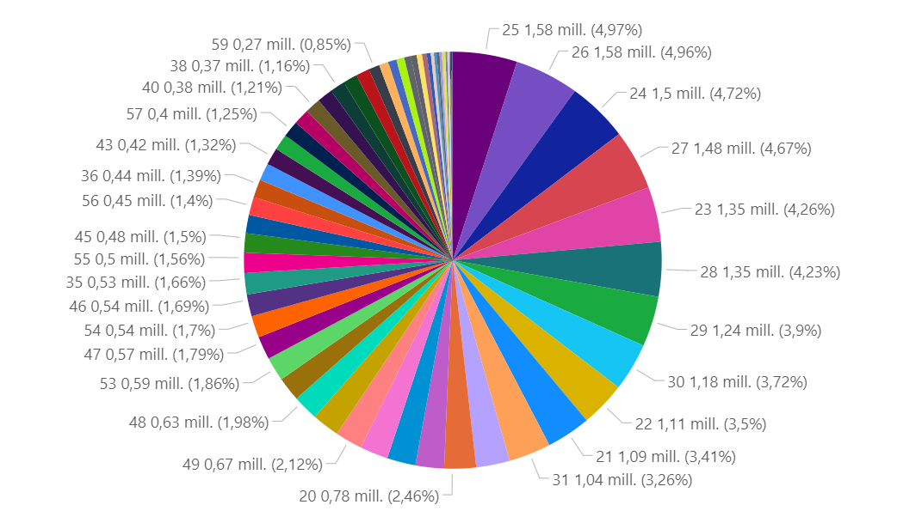
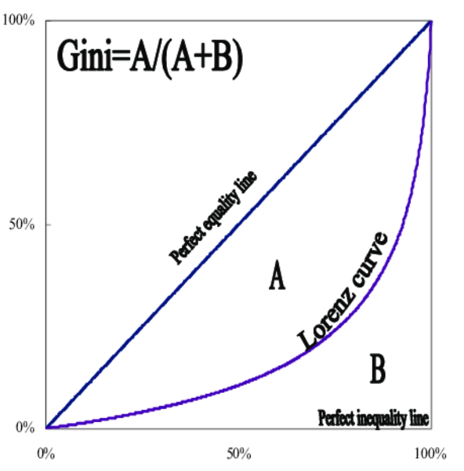
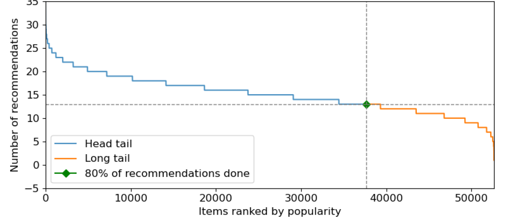
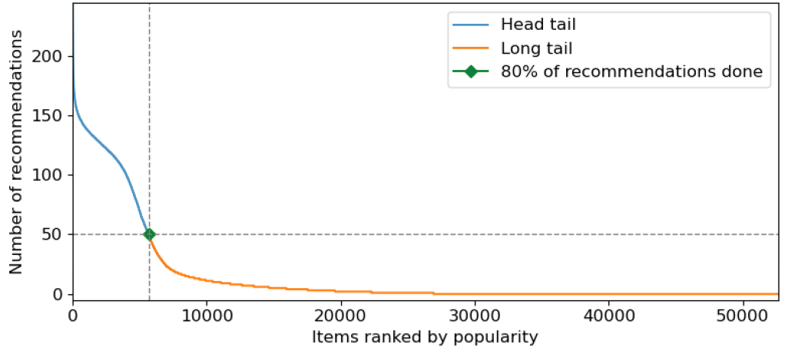

# AIDL22: Recommender Systems with GNN

This repository contains different machine learning models implementations, such as FM, GCN and GAT, that are commonly used to build personalized <b>Recommender Systems</b>. 

Our project aims to understand and compare the different models and evaluate how well they perform in making recommendations, taking as a example a real case study from the fashion industry. In order to do this we will measure some metrics for each of them (HR, NDCG, Coverage, etc...) that are frequently used in this type of systems.

Finally, we will perform a detailed analysis of the obtained results in order to detect and assess possible biases. 

### About
Final Project for the UPC [Artificial Intelligence with Deep Learning Postgraduate Course](https://www.talent.upc.edu/ing/estudis/formacio/curs/310402/postgraduate-course-artificial-intelligence-deep-learning/) 2022 online edition, authored by:

* [Bernat Ribes](https://www.linkedin.com/in/bernat-ribes-garcia-247338a0/)
* [Sonia Sánchez](https://www.linkedin.com/in/sosanchez/)
* [Miguel Canals](https://www.linkedin.com/in/mknals/)

Advised by [Paula Gómez](https://www.linkedin.com/in/paulagd-1995/)

## Table of Contents <a name="toc"></a>

- [1. Introduction](#1-intro)
    - [1.1. Motivation](#11-motivation)
    - [1.2. Objectives](#12-milestones)
- [2. H&M Dataset](#2-available-datasets)
    - [2.1. Data Description](#21-eda)
    - [2.2. Pre-processing](#22-preprocessing) 
- [3. Models](#3-models)    
    - [3.1. Evaluation Metrics](#31-metrics)
    - [3.2. Experiment Methods & Test Strategy](#32-experimenttest)
    - [3.3. Models](#33-models)
        - [Factorization Machine](#331-FM)
        - [Graph Convolutional Networks](#332-GCN)
        - [Graph Attention Networks](#333-GAT)
        - [Random](#334-RAND)
        - [Popularity](#335-POP)
- [4. Environment Requirements](#4-requirements)
    - [4.1. Software](#41-software)
    - [4.2. Hardware](#42-hardware)
- [5. Running the code](#5-running)
    - [5.1. Dataset creation](#51-dataset)
    - [5.2. Executing models](#52-models-exec)
        - [5.2.1 Factorization Machine](#521-FM-exec)
        - [5.2.2 Graph Convolutional Networks](#522-GCN.exec)
        - [5.2.3 Graph Attention Networks](#523-GAT-exec)
        - [5.2.4 Random](#524-rand-exec)
        - [5.2.5 Popularity](#525-pop-exec)
    - [5.3. Adding context](#53-context)
        - [5.3.1 Factorization Machine with context](#531-FM-context-exec-FM)
- [6. Results](#6-results)
    - [6.1. Results 10k customers (random sampling testset)](#61-results10K)
    - [6.2. Results 10k customers (full testset)](#62-results10KF)
    - [6.3. Results 80k customers (random sampling testset)](#63-results80K)
    - [6.4. Models Comparison](#64-comparison)
    - [6.5. Customized Reports](#65-reports)
- [7. Conclusions](#7-conclusions) 
- [8. Acknowledgements](#8-acknowledgements)
 
## 1. Introduction <a name="1-intro"></a>

Recommender Systems are a useful tool that automatizes the task of predicting the preferences of the users of a service in order to recommend them items that could match its preferences. They have become a key piece to solve the problem of overload information that we live today. Data is far from being reduced, as well as the diversity of users that use online platforms such as Netflix, with more than 17.000 titles and 221.64 million of paying subscriptions, or Amazon, with 116.44 billion U.S. dollars sales and more than 200 million Prime members.

<p align="left">
  
</p>

But what makes a recommender good? It is not only a question of personalizing the recommendations in such a way that the system shows the users items that are related to their tastes, but also of reflecting the diversity in a fair way, so that users can discover new things that may interest them and, at the same time, ensure that no bias or, worse, discrimination is added to the recommendations. Of course, some items are popular for a reason, so it is important to find a trade-off between accuracy and fairness. We want to reduce the <b>Popularity Bias</b>. [Paper: Managing Popularity Bias in Recommender Systems
with Personalized Re-ranking](https://arxiv.org/pdf/1901.07555.pdf)

<p align="left">
  
</p>

### 1.1. Motivation <a name="11-motivation"></a>

In this project we have compared differents methods and models to make recommendations in order to find out which gives more balanced results in terms of accuracy and fairness, trying to reduce the popularity bias without damaging the quality of the ranking.

### 1.2. Objectives <a name="12-milestones"></a>

The main purpose of this project is to learn and test the potencial of some traditional Recommender System models and understand their behaviour. 

In particular, we will start by detailing Factorization Machine model and extend it by introducing Graph Convolutional Networks and Graph Attention Networks to analyze and quantify its improvmement. Finally, we will create Random and Popularity models and compare the results obtained with all the models. Through the results, we will be able to evaluate how Popularity Bias affect each model. 

To be more specific, main project objectives are:
- Find a complete dataset that fits the task. In this case we opted for real dataset from H&M fashion brand.
- Explore and undestand the data, clean and pre-process it to be able to use it for training and testing our models.
- Implement different simple models such as Random and Popularity recommenders.
- Implement a Factorization Machine model with regular embeddings and extend it by adding embeddings generated by a GCN and GAT. 
- Analyze and compare the results obtained with all the models (using different types of metrics).
- Explore the popularity bias and analyze to what extent it affects each model.
- Carry out some experiments of adding more data to the model to see how it improves.
- Add context to the model in order to quantify its improvement in the different metrics.
- Extract conclusions and insights from the results and visualize them in an understandable way.

## 2. H&M Dataset <a name="2-available-datasets"></a>

For training and testing our models, we have used the dataset provided by Kaggle competition [H&M Personalized Fashion Recommendations
](https://www.kaggle.com/c/h-and-m-personalized-fashion-recommendations).

H&M Group is a family of brands and businesses with 53 online markets and approximately 4,850 stores. In this competition, H&M Group invited users to develop product recommendations based on data from previous transactions, as well as from customer and product meta data. The available meta data spans from simple data, such as garment type and customer age, to text data from product descriptions, to image data from garment images.

H&M dataset contains data from all the transactions that took place during 2018-2020 period, as well as some costumer and article metadata, including images of all the involved products.

### 2.1. Data Description  <a name="21-eda"></a>

H&M dataset is divided into several different files:
- articles.csv - detailed metadata for each article_id available for purchase
- customers.csv - metadata for each customer_id in dataset
- transactions_train.csv - training data, consisting of the purchases each customer for each date, as well as additional information (i.e. channel).

<p align="left">
  
</p>

As a result of a preliminary analysis of the dataset, we have observed the following characteristics:

<div style="overflow-x:auto;">
  <table>
    <tr><td>
         <p align="left">Most of the costumers are young</p>
         <p align="center">
            
         </p>
        </td>
        <td>
         <p align="left">Transactions are equally distributed by costumer's age</p>
         <p align="center">
            
         </p>
        </td>
      </tr>
      <tr><td>
         <p align="left">There are some product categories that are more popular than others (i.e. ladieswear)</p>
         <p align="center">
            
         </p>
        </td>
        <td>
         <p align="left">There is a predominant product color (black)</p>
         <p align="center">
            
         </p>
        </td>
      </tr>
       <tr><td>
         <p align="left">There is a predominant channel (2) for purchasing articles</p>
         <p align="center">
            
         </p>
        </td>
         <td>
         <p align="left">Most of the costumers do not see the news</p>
         <p align="center">
            
         </p>
        </td>
  </table>
</div>

### 2.2. Pre-processing  <a name="22-preprocessing"></a> 

Due to computational limitations, we have decided to apply a series of different filters in order to reduce the number of transactions:

- Articles that have been purchased more than 5 times
- Customers who have bought more than 20 articles
- Reduce data range for the last year
- Shuffle & pick N customers (10K and 80K in our case study)

These values can be modified in any time by following the steps defined in: [5.1. Dataset creation](#51-dataset)

Results after applying data filtering:

|             Filtered Dataset features - 10K      | | 
|:------------------------:|:-------:|
|Number of articles    | 38.782|
|Number of costumers                | 10.000|
|Number of transactions  | 489.710|
|Data range  | 2020|

|             Filtered Dataset features - 80K      | | 
|:------------------------:|:-------:|
|Number of articles    | 52.661|
|Number of costumers                | 80.000|
|Number of transactions  | 3.990.745|
|Data range  | 2020|

After doing some analysis of the resulting data, we have computed the long-tail graph to show the distribution of popularity among articles in the dataset (for both 10K and 80K customers).

<p align="left">
  
</p>

Products on left side (or in blue line) are called as popular because their popularity is higher then those in yellow or long-tail area. Moreover, popular products are generally competitive products. On the other hand, products in yellow long-tail area are thought to be unpopular or new products in market. The threshold which discriminates the popular and unpopular items in market is an hyper-parameter for the retailer. 

As it can be seen, it appears that our H&M dataset has some popularity bias since very few articles occupy nearly 80% of the total transactions.

`Short Head: 12.667 articles 24.10% (80%) - Max Ranking 5283 votes`
                                                       
## 3. Models <a name="3-models"></a>

Under this section we present all the different models that we have used for implementing the Recommender Systems, as well as the different evaluation metrics that we have measured in order to compare their performance.

### 3.1. Evaluation Metrics  <a name="31-metrics"></a>

We have implemented different types of metrics, that are popular in the Recommender systems field, in order to evaluate model performance in terms of accurracy and fairness. All the metrics have been calculated taking into account a model that provides the TOPK article recommendations, where K in our case is 10. We have considered this approach since we are interested in evaluating the quality of the top recommendations.

- #### HIT RATIO (HR)

In Recommender settings, the Hit Ratio can be described as the fraction of users for which the correct answer is included in the recommendation list of length TOPK. The larger TOPK is, the higher HR becomes. [Source: Ranking Evaluation Metrics for Recommender Systems](https://towardsdatascience.com/ranking-evaluation-metrics-for-recommender-systems-263d0a66ef54)

- #### Normalized Discounted Cumulative Gain (NDCG)

NDCG is also commonly used as a measure of ranking quality, since it takes into account the position where articles have been recommended in the TOPK list. The idea of DCG is that highly relevant articles appearing lower in a recommendations list should be penalized, and relevance value is reduced logarithmically proportional to the position of the result. NDCG is computed as the normalization of DCG score by IDCG, delimiting its value between 0 and 1 regardless of the length. [Source: Ranking Evaluation Metrics for Recommender Systems](https://towardsdatascience.com/ranking-evaluation-metrics-for-recommender-systems-263d0a66ef54)

- #### COVERAGE

Coverage can be described as the percentage of articles in the training dataset that the model has been able to cover when computing the TOPK recommendations for all the users of the test dataset.

- #### GINI

Gini index is commonly used to to assess the diversity of the recommendations. The Gini coefficient is defined based on the Lorenz curve, that plots the percentiles of the items on the graph's horizontal axis according to the number of recommendation (or purchases). The cumulative recommendations/purchases is plotted on the vertical axis. An index value of 1 means that a single item is being recommended to all users, where a value of 0 means that all items are recommended equally to all the users.

<p align="left">
  
</p>

In our case study, we will try to adjust the recommendation algorithm in order to increase the coverage of products and improve the distribution of article recommendations.

- #### NOVELTY

To evaluate the novelty we use the mean self-information (MSI) also call Surprise. The intuition behind quantifying information is the idea of measuring how much surprise there is in an event. Those events that are rare (low probability) are more surprising and therefore have more information than those events that are common (high probability). [Source: A Gentle Introduction to Information Entropy](https://machinelearningmastery.com/what-is-information-entropy/)

Low Probability Event: High Information (surprising).
High Probability Event: Low Information (unsurprising).

Information will be zero when the probability of an event is 1.0 or a certainty there is no surprise.
We calculate it as `-log(p(i))` where p(i) is popularity of the item. [Paper: Optimizing Novelty and Diversity in Recommendations](https://digibuo.uniovi.es/dspace/bitstream/handle/10651/50960/diez2018.pdf?sequence=1)

- #### Measure Assessment

Measure | Bar | 
:------: | :------:|
HIT RATIO   |The higher the better, more accuracy  | 
NDCG   |The higher the better, meaningful results first    | 
COVERAGE |The higher the better, more items recommended  |  
GINI   |The lower the better, more equity    |
NOVELTY |The higher the better, less popular items included in the recommendations   |

### 3.2. Experiment Methods & Test Strategy  <a name="32-experimenttest"></a>
Our experiments are based on <b>offline testing</b>. We use implicit feedback, where the purchases of each user are available as positive items, while all non-interacted items are considered as negative.

In order to have a faster training and reduce its computational cost, we have opted for using a <b>random sampling</b> approach to build the target test datasets. As some papers pointed out that by using this method the ranking (comparison) of the models could not be estable, we have tested them with all the items included in the training dataset as target (except the interactions of each user) in order to compare the results and verify that our ranking and relation among metrics of models remained equal. Since it was the case, we have decided to mantain this strategy for the rest of experiments. [Paper: A Case Study on Sampling Strategies for Evaluating Neural Sequential Item Recommendation Models](https://arxiv.org/pdf/2107.13045.pdf)

### 3.3. Models  <a name="33-models"></a>

### Factorization Machine <a name="331-FM"></a>

<b>Embeddings</b>

Once we have generated our train and test datasets, we need a way to personalize users (customers) and items (articles). In order to do so, embeddings are commonly used. An embedding can be described as a relatively low-dimensional space into which you can translate high-dimensional vectors. They encode different features information across some given dimensions.

Given enough data, we can train an algorithm to understand relationships between entities and automatically learn features to represent them.

<b>Matrix Factorization</b>

Our Recommender systems are based on collaborative filtering, which objective is to discover the similarities on the user’s past behavior and make predictions to the user based on a similar preference with other users. This model is then used to predict items (or ratings for items) that the user may have an interest in.

Matrix factorization is a way to generate latent features when multiplying two different kinds of entities. Collaborative filtering is the application of matrix factorization to identify the relationship between items’ and users’ entities. With the input of users’ transactions on different articles, we would like to predict whether users would like certain articles so the users can get the recommendation based on the prediction.

<p align="left">
  
</p>

The way it works is by decomposing the rating matrix (adjacency matrix), which is the one containing all the user-item interactions, into two rectangular matrices of lower dimension whose dot product will result in the same rating matrix again. In that way, we can end up with a matrix of features for each of the users and items, which will contain the latent representation of each of the entities, so we will have computed the embeddings.

<b>Factorization Machine</b>

Factorization Machines (FM) are a supervised Machine Learning technique introduced in 2010 [paper](https://www.csie.ntu.edu.tw/~b97053/paper/Rendle2010FM.pdf). Factorization Machines get their name from their ability to reduce problem dimensionality thanks to applying matrix factorization techniques.

<p align="left">
  
</p>

In our case study, we will be evaluating Factorization Machine with and without context. When adding context, we will be considering the channel where the transaction has been done. In that sense, our rating matrix (adjacency) would look like:

<p align="left">
  
</p>

Prior to the test, we will be generating a number of <b>negative samples</b> in order to have test cases where we know that the user has not bought that particular article, so we can make a better evaluation of the model's performance.

Finally, we will be computing Factorization Machine with regular embeddings as well as using Graph Convolutional Networks to extend this model so they can capture high-order interactions between features.

Expected behaviour:

|Hit Ratio|NDCG|Coverage|Gini Index|Novelty (MSI)|Computational resources| 
|------:|-------:|----------------:|--------------:|--------------:|-------------:|
|Medium|Medium|Medium|Medium|Medium|Medium|

### Graph Convolutional Networks <a name="332-GCN"></a>

Factorization Machines add some side information to the possible interactions through extending the feature vectors, which may provoke a very high number of parameters, specially when adding different features. Graph Convolutional Networks helps to address this problem by making use of Knowledge Graphs to represent the available data, since it is an easier way to consider more entities involved in the interactions.

In order to identify rating patterns on the graph, we use Graph Convolutional Networks, that perform convolutions on the graph in the same way that Convolutional Neural Networks do on images. They work by assuming that connected nodes tend to be similar and share labels and they enable us to identify high-order
interactions between features.

GCNs take as an input:
- A Feature Matrix X (n×d) where n is the number of nodes and d is the number of features per node. Every row of it represents a description in d features of one of the nodes.
- A matrix A (n×n) called Adjacency Matrix that describes the connectivity in the graph, by specifying the edges in the graph.

They perform the following propagation rule:

<p align="left">
  
</p>
Where:
- A is the adjacency matrix.
- D is the diagonal matrix that normalizes A by taking the average of neigh-boring node features.
- Â = A + I, where I is the Identity Matrix.  This way, we add self-connections to our adjacency matrix and we will reflect the node itself
in the graph interactions.
- σ is an activation function (for example, ReLU).
- W(l) is a matrix of layer-specific trainable weights.

Expected behaviour:

| Hit Ratio   | NDCG |  Coverage |   Gini Index |  Novelty (MSI)  | Computational resources   
|------|-------:|----------------:|--------------:|--------------:|-------------:|
|High|High|Medium|Medium|Medium|High

### Graph Attention Networks <a name="333-GAT"></a>

Graph Attention Network (GAT) is a neural network architecture that operates on graph-structured data, leveraging masked self-attentional layers to address the shortcomings of prior methods based on graph convolutions or their approximations. By stacking layers in which nodes are able to attend over their neighborhoods’ features, the method enables (implicitly) specifying different weights to different nodes in a neighborhood, without requiring any kind of costly matrix operation (such as inversion) or depending on knowing the graph structure upfront.

GAT helps to assess one of the problems of GCNs, which way to aggregate messages is structure-dependent, affecting its generalizability. Instead, GAT introduces the attention mechanism as a substitute for the statically normalized convolution operation. The figure below clearly illustrates the key difference:

<p align="left">
  
</p>

Expected behaviour:

| Hit Ratio   | NDCG |  Coverage |   Gini Index |  Novelty (MSI)  | Computational resources   
|------|-------:|----------------:|--------------:|--------------:|-------------:|
|Very high|Very high|Medium|Medium|Medium|Very high

### Random <a name="334-RAND"></a>

Popularity recommender models allows to predict any items (randomly selected) that a particular costumer has not previously purchased.

Expected behaviour:

| Hit Ratio   | NDCG |  Coverage |   Gini Index |  Novelty (MSI)  | Computational resources   
|------|-------:|----------------:|--------------:|--------------:|-------------:|
|Low|Low|High|Close to 0|High|Low

### Popularity <a name="335-POP"></a>

Popularity recommender models allows to predict most popular items (with more interactions) that a particular costumer has not previously purchased. This is the most basic recommendation system which provides generalized recommendation to every user depending on the popularity. Whatever is more popular among the general public, is more likely to be recommended to new customers. The generalized recommendation is not personalized, is based on the count.

Expected behaviour:

| Hit Ratio   | NDCG |  Coverage |   Gini Index |  Novelty (MSI)  | Computational resources   
|------|-------:|----------------:|--------------:|--------------:|-------------:|
|High|High|Low|Close to 1|Low|Low

## 4. Environment Requirements <a name='4-requirements'>

### 4.1. Software  <a name='41-software'></a>
    
#### Installing Python
Before continuing, make sure you have Python installed and available from your command line. You can check this by simply running:

```
#!/bin/bash
$ python --version
```
Your output should look similar to: 3.8.2. If you do not have Python, please install the latest 3.8 version from [python.org](https://www.python.org/).

#### Setting up the Python environment:

Make sure you have Conda installed and available from your command line. You can check this by simply running:

```
$ conda -V
```
Your output should look similar to: conda 4.13.0. If you do not have Conda, please install the latest version from [conda.io](https://docs.conda.io/en/latest/)
    
Then we create the environment and activate it.

```
conda create --name [EnvName] python=3.8
conda activate [EnvName]
```
#### Installing dependencies:

We need to install all the required packages:

```
conda install pytorch torchvision torchaudio cudatoolkit=10.2 -c pytorch
conda install pyg -c pyg
conda install scikit-learn-intelex
conda install -c conda-forge tensorboard
conda install -c conda-forge gdown 
conda install -c pytorch torchtext 
conda install -c anaconda more-itertools 
conda install -c conda-forge spacy 
conda install -c conda-forge matplotlib 
```   
#### Downloading the program:

You can download the program by running the following command on the GitHub GUI:
```
gh repo clone ssanchezor/GNN-RS
```
Or manually by accessing the following url: [GNN-RS](https://github.com/ssanchezor/GNN-RS.git)
    
### 4.2. Hardware  <a name='42-hardware'></a> 

During the early stages of the software development, we have used Google Colab to build the models. This work environment provided us an easy way to work in teams and have access to GPUs. However, specially when implementing GCN and GAT models, due to its high computing demands, we have created a Google Cloud virtual machine instance to train the models.
   
Tools:
- Google Colab
- Local machine: Ubuntu - I7 machine 48 GB with 2 x 1070 RTX 8 GB GPUs
- Google Cloud Platform: n1-highmem-2 machine and 4 NVIDIA Tesla k80 GPUs

## 5. Running the code <a name='5-running'></a>
    
The program is divided into different files that can be grouped as:
    
#### General:
| File                                                                                                                                                                            |Description                                                                                                                                    |
| ------------------------------------------------------------------------------------------------------------------------------------------------------------------------------- |---------------------------------------------------------------------------------------------------------------------------------------------- |
| [data_filtering.py](https://github.com/ssanchezor/GNN-RS/blob/main/Program/data_filtering.py)                                                                       |Applies some filters to reduce the original dataset                                                                                                       |
| [build_dataset.py](https://github.com/ssanchezor/GNN-RS/blob/main/Program/build_dataset.py)                                                                         |Generates train and test datasets (without context)                                                                                                      |
| [build_dataset_context.py](https://github.com/ssanchezor/GNN-RS/blob/main/Program/build_dataset_context.py)                                                                            |Generates train and test datasets (with context)                                                                                                                   |
| [train.py](https://github.com/ssanchezor/GNN-RS/blob/main/Program/train.py)                                                                   |Defines train and test functions, as well as evaluation metrics                                                                                             |
| [utilities.py](https://github.com/ssanchezor/GNN-RS/blob/main/Program/utilities.py)                                                     |Defines custom report functions                                                                          |

#### Models:

| File                                                                                                                                                                            |Description                                                                                                                                    |
| ------------------------------------------------------------------------------------------------------------------------------------------------------------------------------- |---------------------------------------------------------------------------------------------------------------------------------------------- |
| [model_FM.py](https://github.com/ssanchezor/GNN-RS/blob/main/Program/model_FM.py)                                                                       |Defines Factorization Machine model (without context)                                                                                                       |
| [model_FM_context.py](https://github.com/ssanchezor/GNN-RS/blob/main/Program/model_FM_context.py)                                                                         |Defines Factorization Machine model (with context)                                                                                                      |
| [model_GCN.py](https://github.com/ssanchezor/GNN-RS/blob/main/Program/model_GCN.py)                                                                            |Defines Graph Convolutional Network and Graph Attention Network models                                                                                                          |
| [model_Random.py](https://github.com/ssanchezor/GNN-RS/blob/main/Program/model_Random.py)                                                                   |Defines Random model                                                                                           |
| [model_Popularity.py](https://github.com/ssanchezor/GNN-RS/blob/main/Program/model_Popularity.py)                                                     |Defines Popularity model      

#### Main:  

| File                                                                                                                                                                            |Description                                                                                                                                    |
| ------------------------------------------------------------------------------------------------------------------------------------------------------------------------------- |---------------------------------------------------------------------------------------------------------------------------------------------- |
| [main_FM.py](https://github.com/ssanchezor/GNN-RS/blob/main/Program/main_FM.py)                                                                       |Executes Factorization Machine recommender system (without context)                                                                                                   |
| [main_FM_context.py](https://github.com/ssanchezor/GNN-RS/blob/main/Program/main_FM_context.py)                                                                         | Executes Factorization Machine recommender system  (with context)                                                                                                     |
| [main_GCN.py](https://github.com/ssanchezor/GNN-RS/blob/main/Program/main_GCN.py)                                                                            |Executes Graph Convolutional Network recommender system                                                                                                         |
|[main_GCN_att.py](https://github.com/ssanchezor/GNN-RS/blob/main/Program/main_GCN_att.py)                                                                            |Executes Graph Attention Network recommender system                                                                                                         |    
| [main_Random.py](https://github.com/ssanchezor/GNN-RS/blob/main/Program/main_Random.py)                                                                   |Executes Random recommender system
| [main_Popularity.py](https://github.com/ssanchezor/GNN-RS/blob/main/Program/main_Popularity.py)                                                     |Executes Popularity recommender system
    
In that sense, to execute the program you will need first:
1. Execute `data_filtering.py` to filter the dataset applying the desired restrictions. A file with the reduced dataset will be generated as an output.
2. Execute `build_dataset.py`(or `build_dataset_features.py`if you want context) to generate the required files to build train and test datasets. Two files (one for train and one for test) be generated as an output.
3. Once we have the files generated, we can execute any of the main files depending on the model we want to use (i.e. `main_FM.py` if we want to use Factorization Machine). You can run all of them consecutively without having to perform any of the above steps.
    
### 5.1. Dataset creation <a name="51-dataset"></a>
    
Since the H&M original dataset is too big, we have had to create a filtering program to reduce the dataset and create the input files for the model processing.

#### Starting point: Full Kaggle dataset

Full dataset has been downloaded from Kaggle's competition page: ["H&M Personalized Fashion Recommendations"](https://www.kaggle.com/competitions/h-and-m-personalized-fashion-recommendations)
    
 You can manually download the data or execute the following command by using Kaggle API [Set-up Kaggle API](https://github.com/Kaggle/kaggle-api#readme):  
```
kaggle competitions download -c h-and-m-personalized-fashion-recommendations
``` 
#### Data filtering `data_filtering.py`
 
Downloaded files need to be stored in the `/data/` folder.
 ```
 ../data/articles.csv
 ../data/customers.csv
 ../data/transactions_train.csv
 ```
 The following data filtering actions can be performed with this program:
 - As transaction data spawns from `20-Sep-2018` till `22-Sep-2020`, we can select the temporal range we desire. For our models we have selected initial data as `2019-09-22`, so the program will only make use of later dates.
 - Filter by articles with a minimum number of transactions. In all our models we have considered items with at least `5` transactions.
 - Filter by customers who have done a minimum number of transactions. We have set a minimum of `20` transactions per customer.
 - Finally, we can reduce the size of our dataset by decreasing the number of costumers (in a random manner). In our case, we have used an smaller dataset with `10000` customers and a much larger of `80000` customers. 
 
These restrictions are hardcoded in the program. They can be changed at any time to adjust to each scenario:   
```
ini_date= "2019-09-22" 
min_trans_per_article=5
min_trans_per_customer=20
total_customers=10000
``` 
The file will generate automatically a csv file with these convention:

```
../data/transactions_ddup_{ini_date}_nart_{min_art}_ncust_{min_trans}_ncustr_{customer_number}.csv
```
For example for the selected values, result file will be:

```
transactions_ddup_2019-09-22_nart_5_ncust_20_ncustr_10000.csv
```
This file is the one that will be used as dataset for the models.

For example, after applying the filters with `10.000` and `80.000` customers, our dataset will look like:

| Customers dataset | Number of items | Number of transactions|
|:-----------------:|:---------------:|:---------------------:|
|10.000| 38.200 | 401.000 |
|80.000| 52.600 | 3.272.000 |

#### Creating train and test datasets `build_dataset.py`

We need to transform the previous filtered dataset to train and test datasets. Also, data has to be presented in a indexed format for all items and costumers in order to be able to compute the adjacency matrix.
    
First, we will need to specifiy the path of previously generated dataset file (csv) in the main procedure:
    
```
if __name__ == '__main__':
   transactions = pd.read_csv("../data/transactions_ddup_2019-09-22_nart_5_ncust_20_ncustr_80000.csv")
```
After running the program, it will generate the working files we need to use to run the models.

Once it has been loaded, customer-article transactions are filtered by user and transaction date. The first transaction for each customer will be used to build the test dataset.   
 
Visualizing results:
    
`../data/customer.test.article`

General format:
| customer_id | article_id | label| t_dat|
|:-----------:|:----------:|:----:|:----:|
|...|...|...|...|
|...|...|...|...|
|user i-1|item 1 |1|tdat 1|
|user i|item 1|1|tdat 1|
|user i+1|item 1 |1|tdat 1|
|...|...|...|...|

First transaction for the first 4 users:
| customer_id | article_id | label| t_dat|
|:-----------:|:----------:|:----:|:----:|
|1	|1	|1	|20200519|
|2	|27	|1	|20200618|
|3	|63|	1	|20200613|
|4	|92|	1	|20200618|
|...|...|...|...|
|...|...|...|...|
     
`../data/customer.train.article`

Train data will contain the remaining transactions for each user:
| customer_id | article_id | label| t_dat|
|:-----------:|:----------:|:----:|:----:|
|...|...|...|...|
|...|...|...|...|
|user i-1|item m |1|tdat m|
|user i|item 2|1|tdat 2|
|user i|item 3||tdat 3|
|...|...|...|...|
|user i|item n |1|tdat n|
|user i+1|item 2 |1|tdat 2|
|...|...|...|...|
|...|...|...|...|

For instance, for user 38:
| customer_id | article_id | label| t_dat|
|:-----------:|:----------:|:----:|:----:|
|...|...|...|...|
|...|...|...|...|
|37	|1241	|1	|20190927|
|38	|548	|1	|20200901|
|38	|1243	|1	|20200901|
|38	|1244	|1	|20200831|
|38	|1245	|1	|20200831|
|38	|551	|1	|20200831|
|38	|1246	|1	|20200831|
|...|...|...|...|
|38	|1279	|1	|20191123|
|38	|350	|1	|20191123|
|38	|1280	|1	|20191123|
|39	|1282	|1	|20200903|
|...|...|...|...|
|...|...|...|...|

`../data/customer.dic`

This is a dictionary file that will allow us to relate each indexed customer with the customer value in original H&M dataset. This will be only used for reporting purposes.

| actual customer_id | indexed customer_id | 
|-------------------:|:------------------:|
|00011770272...3ccbb8d5dbb4b92	|1|
|00023e3dd86...e0038c6b10f655a	|2|
|0002d2ef78e...bde96e828d770f6	|3|
|0002e6cdaab...98119fa9cb3cee7	|4|
|00045027219...d9a84994678ac71	|5|
|...|...|
|...|...|

`/data/article.dic`

This is dictionary file that will allow us to relate each indexed article with the article value in original H&M dataset. This will be only used for reporting purposes.

| actual aticle_id | indexed article_id | 
|-------------------:|:------------------:|
|708485004|	1|
|820462009|	2|
|863456003|	3|
|570002090|	4|
|863456005|	5|
|...|...|
|...|...|

#### Adding context `build_dataset_features.py` <a name="511-datasetcontext"></a>

The program has the same structure as `build_dataset.py` but the generated files will also include context information (in our case study is the channel). In order to do this, since adding context means having a new column in the transactions file, we have extended the `extract_dictionary` and `generate_dataset` classes to also consider this new information.

Visualizing results:
    
`../data/customer.test.article.channel`

General format:
| customer_id | article_id | chanel_id |label| t_dat|
|:-----------:|:----------:|:----:|:----:|:----:|
|...|...|...|...|...|
|...|...|...|...|...|
|user i-1|item 1| channel 1 |1|tdat 1|
|user i|item 1|channel 1 |1|tdat 1|
|user i+1|item 1 |channel 1 |1|tdat 1|
|...|...|...|...|...|

First transaction for the first 4 users:
| customer_id | article_id | label| t_dat|
|:-----------:|:----------:|:----:|:----:|
|1	|1	|1	|1	|20200519|
|2	|27	|2	|1	|20200618|
|3	|63|1	|	1	|20200613|
|4	|92|2	|	1	|20200618|
|...|...|...|...|
|...|...|...|...|

`../data/customer.train.article.channel`

Train data will contain the remaining transactions for each user:
| customer_id | article_id |  chanel_id | label| t_dat|
|:-----------:|:----------:|:----:|:----:|:----:|
|...|...|...|...|...|
|...|...|...|...|...|
|user i-1|item m |channel m |1|tdat m|
|user i|item 2|channel 2| 1|tdat 2|
|user i|item 3|channel 3||tdat 3|
|...|...|...|...|
|user i|item n |channel n|1|tdat n|
|user i+1|item 2 |channel 2|1|tdat 2|
|...|...|...|...|...|
|...|...|...|...|...|

For instance, for user 38:
| customer_id | article_id | label| t_dat|
|:-----------:|:----------:|:----:|:----:|
|...|...|...|...|
|...|...|...|...|
|37	|1241	|2	|1	|20190927|
|38	|548	|2	|1	|20200901|
|38	|1243	|2	|1	|20200901|
|38	|1244	|2	|1	|20200831|
|...|...|...|...|
|38	|350	|1	|1	|20191123|
|38	|1280	|1	|1	|20191123|
|39	|1282	|1	|1	|20200903|
|...|...|...|...|...|
|...|...|...|...|...|
    
### 5.2. Executing models <a name="52-models-exec"></a>

In our case study we are going to implement and analyze different Recommender System models: Factorization Machine (with and without context), Graph Convolutional Networks, Graph Attention Network, Random and Popularity. All of them are implemented by following a similar structure: 

| Program | Description |
|:------------------------:|:-------:|
|model_[ModelName].py| Definition of the model class |
|main_[ModelName].py| Main program in order to create an instance of the dataset and the dataloader, instantiate the desired model and execute the train and test functions in order to evaluate the performance|
    
For the following methods, all the parameters in the brackets identified as `this` can be fine-tunned to adjust model's behaviour.  

Creating an instance of the dataset and dataloader (`batch_size=256`, `num_negatives_train=4` and `num_negatives_test=99`):
```
# generating full dataset...
full_dataset = CustomerArticleDataset(dataset_path, num_negatives_train=4, num_negatives_test=99)
# splitting dataset into different batches...
data_loader = DataLoader(full_dataset, batch_size=256, shuffle=True, num_workers=0)
```

Creating an instance of the desired model (`Binary Cross Entropy` loss and `Adam` optimizer with `lr=0.001`):
```
# generating the model...
model = ModelName(full_dataset.field_dims[-1], 32).to(device)
criterion = torch.nn.BCEWithLogitsLoss(reduction='mean')
optimizer = torch.optim.Adam(params=model.parameters(), lr=0.001)
```

Training the model (`topk=10` and `num_epochs=20`)
```
# training the model...
    tb = True
    topk = 10 # 10 articles to be recommended
    num_epochs=20

    for epoch_i in range(num_epochs):
        train_loss = train_one_epoch(model, optimizer, data_loader, criterion, device)
        hr, ndcg, cov, gini, dict_recommend, nov, l_info = testpartial(model, full_dataset, device, topk=topk)    
```    

#### 5.2.1 Factorization Machine model <a name="521-FM-exec"></a>

In 'model_FM.py' we define the classes we will need to implement Machine Factorization model.
- `FeaturesLinear`  linear part of the Factorization Machine formula
- `FM_operation` last term of the Factorization Machine formula
- `FactorizationMachineModel` generates Factorization Machine Model with pairwise interactions using regular embeddings
 
In 'main_FM.py' we execute the Factorization Machine recommender system:
- Define a Tersorboard instance to log the metrics (see Note below)
- Create an instance of the dataset (`full_dataset = CustomerArticleDataset(...)`)
- Create a dataloder instance (`data_loader = DataLoader(...)`)
- Create a FM model instance (`model = FactorizationMachineModel(full_dataset.field_dims[-1], 32).to(device)`) 
- Define loss function and optimizer:
    - `criterion = torch.nn.BCEWithLogitsLoss(reduction='mean')`
    - `optimizer = torch.optim.Adam(params=model.parameters(), lr=0.001)`
- For each epoch, train and test the model:
    ```
    for epoch_i in range(num_epochs):
        train_loss = train_one_epoch(model, optimizer, data_loader, criterion, device)
        hr, ndcg, cov, gini, dict_recommend, nov, l_info = testpartial(model, full_dataset, device, topk=topk)
    ```
- Generate custom report (`info_model_report (...)`)
   
Note: Tensorboard information can be disabled by changing the following parameter: `tb=False`

    
#### 5.2.2 Graph Convolutional Network model <a name="522-GCN-exec"></a>
    
In `model_GCN.py` we define the classes we will need to implement Graph Convolutional Network model:
 * `GraphModel` generates different types of embeddings as a function of the attention parameter value. If the attention is set as off, it will use pytorch geometric [`GCNConv`](https://pytorch-geometric.readthedocs.io/en/latest/modules/nn.html)
 * `FactorizationMachineModel_withGCN` implements Factorization Machine model using `FeaturesLinear(field_dims)` and `FM_operation(reduce_sum=True)` functions from the `model_FM.py` and the previous `GraphModel` as embeddings.
    
In 'main_GCN.py' we execute the Graph Convolution Network recommender system:
- Define a Tersorboard instance to log the metrics
- Create an instance of the dataset (`full_dataset = CustomerArticleDataset(...)`)
- Create a dataloder instance (`data_loader = DataLoader(...)`)
- Generate the feature matrix:
```
    identity_matrix = identity(full_dataset.train_mat.shape[0])
    identity_matrix = identity_matrix.tocoo().astype(np.float32)
    indices = torch.from_numpy(np.vstack((identity_matrix.row, identity_matrix.col)).astype(np.int64))
    values = torch.from_numpy(identity_matrix.data)
    shape = torch.Size(identity_matrix.shape)
    identity_tensor = torch.sparse.FloatTensor(indices, values, shape)
    edge_idx, edge_attr = from_scipy_sparse_matrix(full_dataset.train_mat)
```
- Create a GCN model instance:  
  - `attention = False`
  - `model = FactorizationMachineModel_withGCN(full_dataset.field_dims[-1], 64, identity_tensor.to(device), edge_idx.to(device), attention).to(device)`
- Define loss function and optimizer:
    - `criterion = torch.nn.BCEWithLogitsLoss(reduction='mean')`
    - `optimizer = torch.optim.Adam(params=model.parameters(), lr=0.001)`
- For each epoch, train and test the model:
    ```
    for epoch_i in range(num_epochs):
        train_loss = train_one_epoch(model, optimizer, data_loader, criterion, device)
        hr, ndcg, cov, gini, dict_recommend, nov, l_info = testpartial(model, full_dataset, device, topk=topk)
    ```
- Generate custom report (`info_model_report (...)`)

#### 5.2.3 Graph Attention Network model <a name="523-GAT-exec"></a>
 
This model mainly reuses the `model_GCN.py` code. Class is set up according the attention value:
 * `GraphModel` generates different types of embeddings as a function of the attention parameter value. If the attention is set as on, it will use pytorch geometric [`GATConv`](https://pytorch-geometric.readthedocs.io/en/latest/modules/nn.html)
 * `FactorizationMachineModel_withGCN` implements Factorization Machine model using `FeaturesLinear(field_dims)` and `FM_operation(reduce_sum=True)` functions from the `model_FM.py` and the previous `GraphModel` as embeddings.

Execution program 'main_GCN_att.py' is almost the same as 'main_GCN.py', only changing TensorBoard settings to save data in another location as well as changing attention parameter `attention=True`

Note: We only have been able to run this model with the 10.000 user setup.
        
#### 5.2.4 Random model <a name="524-rand-exec"></a>

'model_Random.py' contains a `RandomModel` class that generates a recommender model that is able to predict random articles that the costumer has not previously purchased.
    
In 'main_Random.py' we execute the Random recommender system:
- Define a Tersorboard instance to log the metrics
- Create an instance of the dataset (`full_dataset = CustomerArticleDataset(...)`)
- Create a dataloder instance (`data_loader = DataLoader(...)`)
- Create a Random model instance (`RandomModel(data_loader.dataset.field_dims)`)
- Since there are no parameters to learn, we only execute the test function for 1 epoch:
```
train_loss=0 # no parameters to learn
        hr, ndcg, cov, gini, dict_recomend, nov, l_info = testpartial(model, full_dataset, device, topk=topk)
```
- Generate custom report (`info_model_report (...)`)

#### 5.2.5 Popularity model <a name="525-pop-exec"></a>

'model_Popularity.py' contains a `Popularity_Recommender` class that generates a recommender model that is able to predict the most popular articles that the costumer has not previously purchased.

In 'main_Popularity.py' we execute the Random recommender system:
- Define a Tersorboard instance to log the metrics
- Create an instance of the dataset (`full_dataset = CustomerArticleDataset(...)`)
- Create a dataloder instance (`data_loader = DataLoader(...)`)
- Create a Popularity model instance (`Popularity_Recommender(full_dataset.train_mat)`)
- Since there are no parameters to learn, we only execute the test function for 1 epoch:
```
train_loss=0 # no parameters to learn
        hr, ndcg, cov, gini, dict_recomend, nov, l_info = testpartial(model, full_dataset, device, topk=topk)
```
- Generate custom report (`info_model_report (...)`)
 
### 5.3. Adding context <a name="53-context"></a>
#### 5.3.1 Factorization Machine with context <a name="531-FM-context-exec"></a>

We generated an extension for the Factorization Machine model to be able to add context and quantify to what extent it modifies the performance. In our case, we have decided to add channel information.

As explained in section [Adding context `build_dataset_features.py`](#511-datasetcontext), dataset now will include and extra column in the transaction table to add information about the channel. Therefore, we had to implement some minor changes to the different files:

`model_FM_context.py` has the same structure as `model_FM.py` but:
- Embeddings have higher dimension: `self.embeddings = torch.nn.ModuleList([torch.nn.Embedding(sum(field_dims), embed_dim) for _ in range(self.num_fields)]` 
- Adjacency matrix has higher dimension:
        ```
        adj_mat[x[0], x[1]] = 1.0
        adj_mat[x[1], x[0]] = 1.0
        adj_mat[x[0], x[2]] = 1.0
        adj_mat[x[2], x[0]] = 1.0
        adj_mat[x[1], x[2]] = 1.0
        adj_mat[x[2], x[1]] = 1.0
        ```
- Negative interactions now also consider the channel:
    ```
    # generates a given number (num_negatives) of negative interactions
            for idx in range(num_negatives):
                # generates random interactions
                j = np.random.randint(max_users, max_items)
                k = np.random.randint(max_items, max_channels)
                # loops to exclude true interactions (could be cases where random is true interaction)
                while (x[0], j) in self.train_mat:
                    j = np.random.randint(max_users, max_items)
                    k = np.random.randint(max_items, max_channels)
                neg_triplet[:, 1][idx] = j
                neg_triplet[:, 2][idx] = k
            self.interactions.append(neg_triplet.copy())
    ```

`main_FM_context.py` uses the same structure as `main_FM.py` (only changing the TensorBoard path and instancing `ContextFactorizationMachineModel`)

## 6. Results <a name="6-results"></a>
### 6.1 Results 10K customers (random sampling testset) <a name="61-results10k"></a>

|Model | HR@10 | NDCG@10 |COV@10 |GINI@10 |NOV@10 |COMPUTATIONAL REQUIREMENTS|
:------: | :------:| :------:| :------:| :------:|:------:|:-----------------:|
|Random | 10,33%	|4,76%|92,60%|0,3397|11,3275|	LOW|
|Popularity |39,61%|22,33%|16,42%|0,9006|7,821|LOW|
|FM |20,22%|10,44%|34,42%|0,8525|9,995|LOW|
|FM+Context |36,88%|20,42%|26,51%|0,8448|8,7726|LOW|
|FM + GCN  |36,11%|20,77%|50,97%|0,7351|10,1138|MEDIUM|
|FM + GAT |39,27 %|23,17 %|49,98 %|0,7575|9,1396|VERY HIGH|

As expected, the random model shows the best results regarding the fairness but its accuracy metrics are very poor. On the other hand, the popularity model has the best results in terms of accuracy but recommends a very few number of articles (coverage value is low), meaning that it has a high popularity bias. For this test set, the more balanced model would be FM+GAT, which is able to achieve better results than the others in most of the metrics.

### 6.2 Results 10K customers (full testset) <a name="62-results10kF"></a>

|Model | HR@10 | NDCG@10 |COV@10 |GINI@10 |NOV@10 |COMPUTATIONAL REQUIREMENTS|
:------: | :------:| :------:| :------:| :------:|:------:|:-----------------:|
|Random | 0,00%|0,00%|92,60%|0,3404|11,335|LOW|
|Popularity |1,01%|0,49%|0,04 %|0,9997|4,811|LOW|
|FM |0,15%|0,70%|7,29 %|0,9957|9,327|LOW|
|FM + GCN  |1,03%|0,58%|6,49 %|0,9926|8,465|MEDIUM|
|FM + GAT |2,20 %|1,46%|17,65 %|0,9739|8,465|VERY HIGH|

The test over all items of the training set helps us put the numbers in context and see them with some perspective. The ranking of the models does not change much and the relationship among metrics is kept, but the popularity model shows even a greater bias.

### 6.3 Results 80K customers (random sampling testset) <a name="63-results80k"></a>

|Model | HR@10 | NDCG@10 |COV@10 |GINI@10 |NOV@10 |COMPUTATIONAL REQUIREMENTS|
:------: | :------:| :------:| :------:| :------:|:------:|:-----------------:|
|Random |9,97 %|4,53 %|	100%|0,1456|12,2173|LOW|
|Popularity |47,61 %|27,04 %|18,92 %|0,8978|8,0931|LOW|
|FM |31,38 %|15,98 %|51,33 %|0,8464|9,5201|LOW|
|FM + Context |53,24%|29,99%|39,91%|0,8312|8,6605|LOW|
|FM + GCN  |59,59 %|36,02 %|64,10 %|0,7615|9,1412|MEDIUM|
|FM + GAT |Not feasible|	Not feasible|	Not feasible|	Not feasible|	Not feasible|	VERY HIGH|

Although it has not been possible to compute the FM+GAT model with this dataset due to the memory and GPU it requires, we can expect it to achieve the best results as GCN outperformed Popularity. In that sense, we can see how FM + GCN greatly improved all the metrics by just adding more data. Also, is important to mention that by adding the sales channel as context information for the embeddings in the FM Model, we can see a relevant improvement in most of the results. 

Popularity bias visualization:
<div style="overflow-x:auto;">
  <table>
    <tr><td>
         <p align="left"> <b>Random    </b></p>
         <p align="left">
         
         </p>
        </td>
        <td>
         <p align="left"><b>Popularity </b></p>
         <p align="left">
         
         </p>
        </td>
      </tr>
      <tr><td>
         <p align="left"> <b>Factorization Machine</b></p>
         <p align="left">
         
         </p>
        </td>
        <td>
         <p align="left"><b>Factorization Machine + Context </b></p>
         <p align="left">
         
         </p>
        </td>
      </tr>
       <tr><td>
         <p align="left"> <b>Factorization Machine + GCN</b></p>
         <p align="left">
         
         </p>
        </td>
       </tr>
  </table>
</div>

### 6.4 Models Comparison <a name="64-comparison"></a>   


<div style="overflow-x:auto;">
  <table>
    <tr><td>
         <p align="left"> <b>Radar Chart    </b></p>
         <p align="left">
         
         </p>
        </td>
      </tr>
   </table>
  </div>

Some metrics have been adapted for a better understanding of the graph. For instance, the inverse of the Gini index has been used as reference to diversity, so the closer the result is to 1, the more diverse the recommendations are. Also, the value of novelty has been normalized taking as reference the maximum value obtained in the different models, which in our case is the Random model. 

The ideal recommender would be the one that obtains the highest HR and NDCG values in the first place while maintining coverage, diversity and novelty scores as high as possible. In our case study, the one that presents the more balanced values would be the FM+GCN Model.

### 6.5. Customized reports  <a name='65-reports'></a>
    
We have generated customized reports from the best models to have a deeper understanding of the results, as well as to visualize some of the recommendations. (Values may sligthly differ from other values in this report as have been generated at later stages)

Reports contain:
* Model results
* Recommendation distribution
* First 100 most recommended items
* Recommendations for the first 20 users
* 5 User recommendations with perfect match (HR=1) 
* 5 User recommendations without match

Note: Report configuration (`20/5/5`) can be changed in `utilities.py`
    
Current reports:

* 
* 
* 
* 

With context 

* 

  
## 7. Conclusions <a name="7-conclusions"></a>

* The results of the **FM+GAT** model are promising with a small dataset, but it has not been possible to test it with a larger one due to the computational resources it requires (calculating attention scores considerably increases the number of parameters), although we expect it to achieve the best results. For those scenarios where computational resources are not a problem, seems to be the best model to achieve highest results.

* **FM+GCN** model also gives quite good accuracy results while preserving balanced fairness scores (NDCG, Gini, Novelty, etc.). Since it is somewhat lighter to train than the FM+GAT, it is perfect for softer implementations that do not require really high accuracy rates. As a curiosity, after displaying the results, looks like FM+GCN model is able to propose recommendations that match better with the user style than others, like for example popularity model.
    
* **Popularity** model is a very cheap model with good results in terms of accuracy. However, it has a large index of popularity bias. For those scenarios where accuracy is all that matters, it becomes a good candidate to be considered. 

* By adding **extra context** to the FM Model we have observed relevant improvements in the metrics, so we expect that by doing the same for FM+GCN and FM+GAT will further improve its results in all the metrics. However, we have not been able to ehance the models due to lack of time.

* Our original dataset had a distribution with an obvious **popularity bias**, inherent to the fashion industry, and for this reason it is difficult to obtain better results in terms of **Gini** and **Novelty**. Other strategies could be used to reduce the bias, such as performing a subsequent reranking including more items belonging to the long tail or using a hybrid recommender that always takes into account the user's preferences.

* The selection and interpretation of the differnt metrics to mesure the **fairness** of the recommender systems has not been easy.

## 8. Acknowledgements <a name="8-acknowledgements"></a>

We would like to thank all the teachers from the Prostgraduate Course on Artificial Intelligence with Deep Learning. In particular, a special thanks to our advisor Paula Gómez, for all the materials and advise provided during the project development. 

Also, it is worth mentioning the great help from the Deep Learning community sharing its knowledge with the huge amount of articles and code available through the Internet, from which we have been inspired to make the project.

Finally, we would also thanks our families for its patience and support during this months. It has been a hard but an amazing journey.
