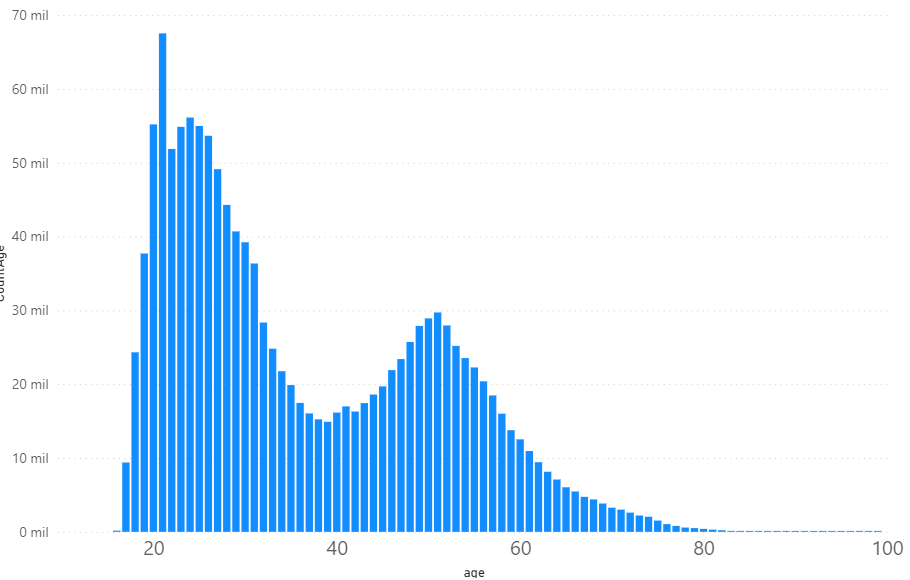
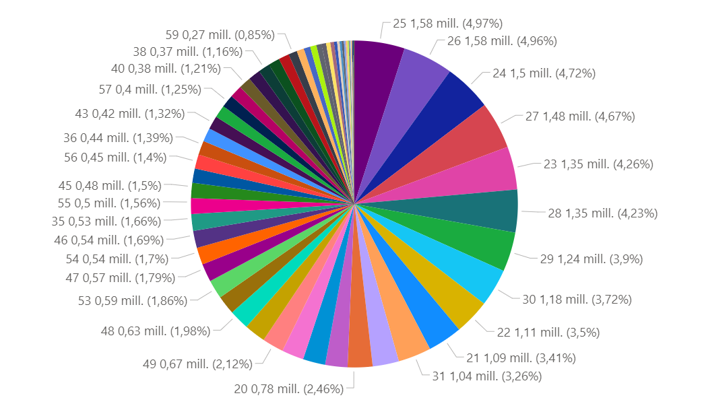
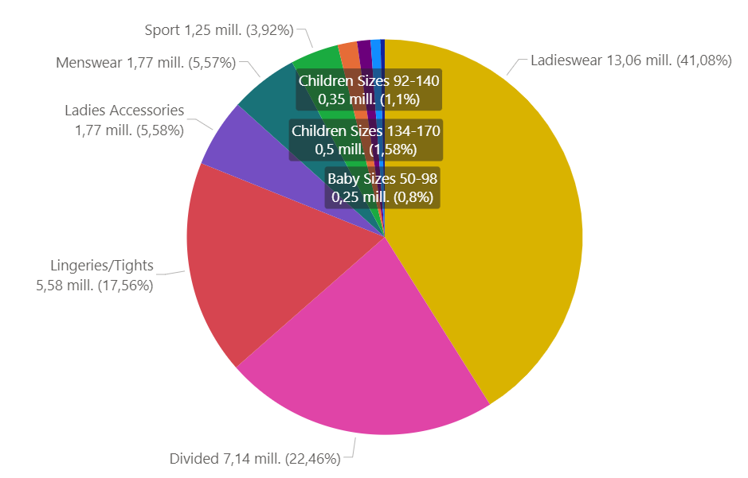
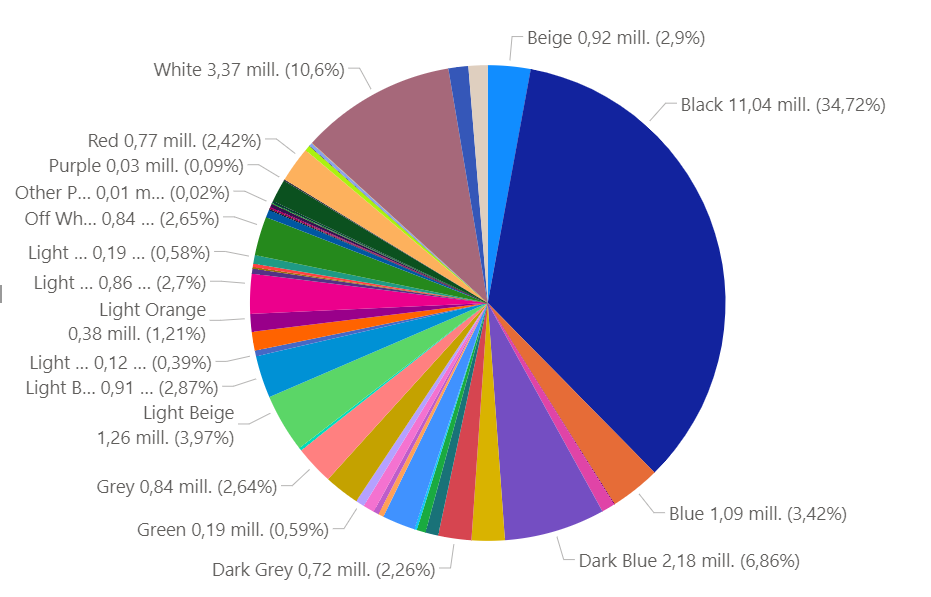
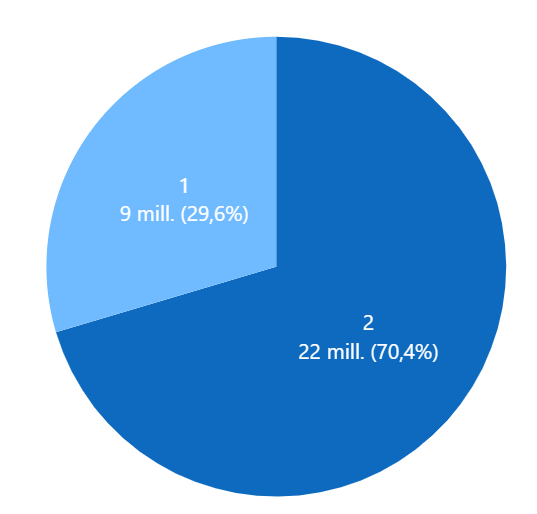
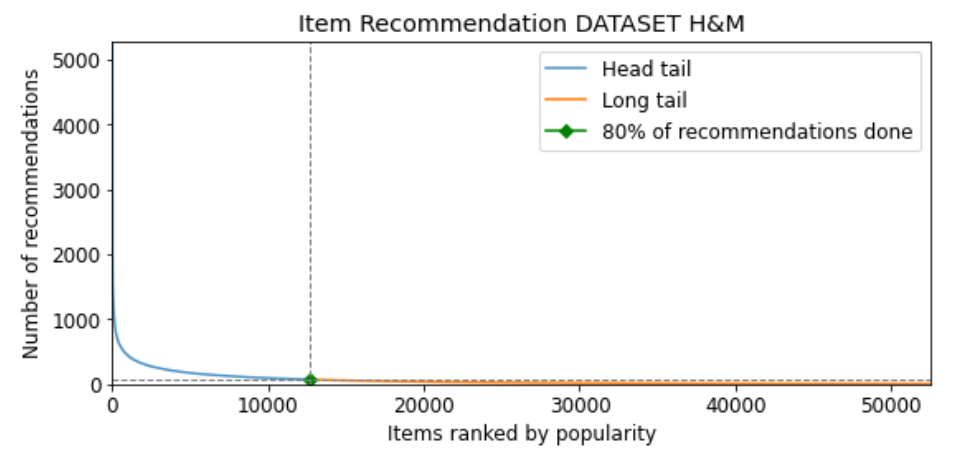
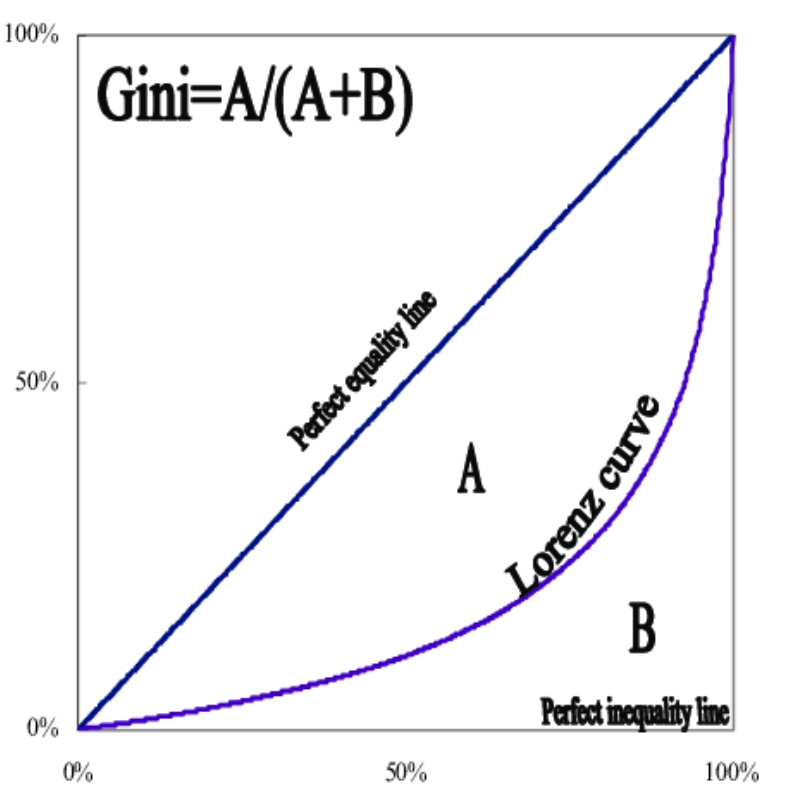
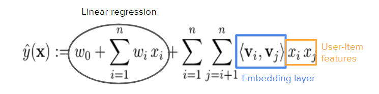

# AIDL21: Recommender Systems with GCN

This repository contains different machine learning models, such as FM, GCN and GAT, that are commonly used to implement personalized Recommender Systems. It consists of a first part to explain, in a theoretical manner, the main characteristics of this type of systems, as well as a second part with a set of detailed steps on how to run the program.

Our project aims to compare the different models and evaluate how well they perform in making recommendations, in this case focusing on a real example from the fashion industry. In order to do this, for each of them, we will measure some metrics (HR, NDCG, Coverage, etc...) that are frequently used in this kind of systems.

Finally, we will perform a detailed analysis of the obtained results in order to detect and assess possible biases. 

### About
Final Project for the UPC [Artificial Intelligence with Deep Learning Postgraduate Course](https://www.talent.upc.edu/ing/estudis/formacio/curs/310402/postgraduate-course-artificial-intelligence-deep-learning/) 2021-2022 online edition, authored by:

* [Bernat Ribes](https://www.linkedin.com/in/bernat-ribes-garcia-247338a0/)
* [Sonia Sánchez](https://www.linkedin.com/in/sosanchez/)
* [Miguel Canals](https://www.linkedin.com/in/mknals/)

Advised by [Paula Gómez](https://www.linkedin.com/in/paulagd-1995/)

## Table of Contents 

- [1. Introduction](#1-intro)
    - [1.1. Motivation](#11-motivation)
    - [1.2. Objectives](#12-milestones)
- [2. H&M Dataset](#2-available-datasets)
    - [2.1. Data Description](#21-eda)
    - [2.2. Pre-processing](#22-preprocessing) 
- [3. Models](#3-models)    
    - [3.1. Evaluation Metrics](#31-metrics)
    - [3.2. Experiment Methods & Test Strategy](#32-experimenttest)
    - [3.3. Machine Learning Models](#33-ML)
        - [Random](RAND)
        - [Popularity](POP)
        - [FM with regular embeddings](FM)
        - [FM with GCN embeddings](FMGCN)
        - [FM with GAT embeddings](FMGAT)
    - [3.3. Adding context](#32-efficientnet) 
- [4. Environment Requirements](#4-envs)
    - [4.1. Software](#41-software)
    - [4.2. Hardware](#42-hardware)
- [5. How to run the program](#5-program) 
- [6. Results](#6-results)
- [7. Conclusions](#7-conclusions) 
- [8. Acknowledgements](#8-acknowledgements)
 
## 1. Introduction 

Nowadays Recommender Systems have become a key peace to solve the problem of overload information. The information if far for being reduced, as well as the diversity of users that uses platform such as  Netflix, wirh more than 17.000 titles and 221.64 million of paying subscriptions, or Amazon, with116.44 billion U.S. dollars sales and more than 200 million Prime members.

But what makes a recommender a good recommender? It is not only a question of personalizing the recommendations in such a way that the system shows the user items related to their tastes, but also of reflecting the diversity in a fair way, so that users can discover new things that may interest them and, at the same time, the systems ensure that no bias or, worse, discrimination is added.

Of course, some items are popular for a reason, so it is important to find a trade-off between accuracy & fairness.

### 1.1. Motivation 

In this project we have compared differents methods and models to make  recommendations and we have tried to find out which of them gives  more balanced results in terms of hits and fairness, reducing the popularity bias without damaging the quality of the ranking.

### 1.2. Objectives 

The main purpose of this project is to test the potencial of deep neural networks to solve the problem of personalize recommendations, in particular the use of Graph convolutional networks and Graph attention networks and to analyze how to popularity bias affect  each model.  To be more specific, the main objectives are the following:
- Find a complete dataset that fits the task. In this case we opted for an H&M dataset.
- Explore and undestand the data, clean and pre-process it to be used for training and test our models.
- Implement different simple models as Random and Popularity to have a reference.
- Implement a Factorization Machine with regular embeddings and after add embeddings generated by an GCN and GAT and analyze the results.
- Explore the Popularity Bias and analyze how it affects each model.
- Carried out some experiments adding more data expecting improvements in the results.
- Add some features related to the contexto of the transaction a evaluate how each model results is affected.
- Extract conclusions and insights from the results and visualize them in an understandable way.

## 2. H&M Dataset 

For training and testing our models, we have used the dataset provided by Kaggle competition [H&M Personalized Fashion Recommendations
](https://www.kaggle.com/c/h-and-m-personalized-fashion-recommendations).

H&M Group is a family of brands and businesses with 53 online markets and approximately 4,850 stores. In this competition, H&M Group invited users to develop product recommendations based on data from previous transactions, as well as from customer and product meta data. The available meta data spans from simple data, such as garment type and customer age, to text data from product descriptions, to image data from garment images.

H&M dataset contains data from all the transactions that took place during 2018-2020 period, as well as some costumer and article metadata, including images of all the involved products.

### 2.1. Data Description  

H&M dataset is divided into several different files:
- articles.csv - detailed metadata for each article_id available for purchase
- customers.csv - metadata for each customer_id in dataset
- transactions_train.csv - training data, consisting of the purchases each customer for each date, as well as additional information (i.e. channel).

|             Dataset features      | | 
|:------------------------:|:-------:|
|Number of articles    | 105.542|
|Number of costumers                | 1.371.980|
|Number of transactions  | 31.788.324|
|Data range  | From 2018 to 2020 |

As a result of a preliminary analysis of the dataset, we have observed the following characteristics:

· Higher accumulation of younger costumers:

  

· Quite uniform distribution in transactions grouped by costumer's age:

  

· Non-uniform distribution in transactions grouped by product category:

  

· Non-uniform distribution in transactions grouped by product color:

  

 
 · Predominant channel (2) for the articles purchase:

  

### 2.2. Pre-processing   

Due to computational limitations, we have decided to apply a series of different filters in order to reduce the number of transactions:

- Articles that have been purchased more than 5 times
- Customers who have bought more than 20 articles
- Reduce data range for the last year
- Shuffle & pick N customers (10K and 80K in our study case)

These values can be modified in any time by following the steps defined in: [1.2. Objectives](#12-milestones)

Results after applying data filtering:

|             Filtered Dataset features - 10K      | | 
|:------------------------:|:-------:|
|Number of articles    | 38.782|
|Number of costumers                | 10.000|
|Number of transactions  | 489.710|
|Data range  | 2020|

|             Filtered Dataset features - 80K      | | 
|:------------------------:|:-------:|
|Number of articles    | 52.661|
|Number of costumers                | 80.000|
|Number of transactions  | 3.990.745|
|Data range  | 2020|

After doing some analysis of the resulting data, we have computed the long-tail graph to show the distribution of popularity among articles in the dataset (for both 10K and 80K customers).

  

Products on left side (or in blue line) are called as popular because their popularity is higher then those in yellow or long-tail area. Moreover, popular products are generally competitive products. On the other hand, products in yellow long-tail area are thought to be unpopular or new products in market. The threshold which discriminates the popular and unpopular items in market is an hyper-parameter for the retailer. 

As it can be seen, it appears that our H&M dataset has some popularity bias since very few articles occupy nearly 80% of the total transactions.

`Short Head: 12.667 articles 24.10% (80%) - Max Ranking 5283 votes`
                                                       
## 3. Models 

Under this section we present all the different models that we have used for implementing the Recommender Systems, as well as the different evaluation metrics that we have measured in order to compare their performance.

### 3.1. Evaluation Metrics  

We have implemented different types of metrics, that are popular in the Recommender systems field, in order to evaluate model performance in terms of accurracy and fairness. All the metrics have been calculated taking into account a model that provides the TOPK article recommendations, where K in our case is 10. We have considered this approach since we are interested in evaluating the quality of the top recommendations.

- #### HIT RATIO (HR)

In Recommender settings, the Hit Ratio can be described as the fraction of users for which the correct answer is included in the recommendation list of length TOPK. The larger TOPK is, the higher HR becomes. [Source](https://towardsdatascience.com/ranking-evaluation-metrics-for-recommender-systems-263d0a66ef54)

- #### Normalized Discounted Cumulative Gain (NDCG)

NDCG is also commonly used as a measure of ranking quality, since it takes into account the position where articles have been recommended in the TOPK list. The idea of DCG is that highly relevant articles appearing lower in a recommendations list should be penalized, and relevance value is reduced logarithmically proportional to the position of the result. NDCG is computed as the normalization of DCG score by IDCG, delimiting its value between 0 and 1 regardless of the length. [Source](https://towardsdatascience.com/ranking-evaluation-metrics-for-recommender-systems-263d0a66ef54)

- #### COVERAGE

Coverage can be described as the percentage of articles in the training dataset that the model has been able to cover when computing the TOPK recommendations for all the users of the test dataset.

- #### GINI

Gini index is commonly used to to assess the diversity of the recommendations. The Gini coefficient is defined based on the Lorenz curve, that plots the percentiles of the items on the graph's horizontal axis according to the number of recommendation (or purchases). The cumulative recommendations/purchases is plotted on the vertical axis. An index value of 1 means that a single item is being recommended to all users, where a value of 0 means that all items are recommended equally to all the users.  [Source](https://www.researchgate.net/figure/The-Lorenz-curve-and-Gini-coefficient_fig3_242258189)

  

In our case study, we will try to adjust the recommendation algorithm in order to increase the coverage of products and improve the distribution of article recommendations.

- #### NOVELTY

To evaluate the novelty we use the mean self-information (MSI) also call Surprise. The intuition behind quantifying information is the idea of measuring how much surprise there is in an event. Those events that are rare (low probability) are more surprising and therefore have more information than those events that are common (high probability). [Source](https://machinelearningmastery.com/what-is-information-entropy/)

Low Probability Event: High Information (surprising).
High Probability Event: Low Information (unsurprising).

Information will be zero when the probability of an event is 1.0 or a certainty there is no surprise.
We calculate it as `-log(p(i))` where p(i) is popularity of the item. [Source](https://digibuo.uniovi.es/dspace/bitstream/handle/10651/50960/diez2018.pdf?sequence=1)

- #### Measure Assessment

Measure | Bar | 
:------: | :------:|
HIT RATIO   |The higher the better, more accuracy  | 
NDCG   |The higher the better, meaningful results first    | 
COVERAGE |The higher the better, more items recommended  |  
GINI   |The lower the better, more equity    |
NOVELTY |The higher the better, less popular items included in the recommendations   |

### 3.2. Experiment Methods & Test Strategy  
Our experiments are based on <b>offline testing</b>. We use implicit feedback, where the purchases of each user are available as positive items, while all non-interacted items are considered as negative.

In order to have a faster training and reduce its computational cost, we have opted for using a <b>random sampling</b> approach to build the target datasets. As some papers pointed out that by using this method the model could become inestable, we have tested it with the full test datatest set in order to compare the results and verify that our ranking remains equal. Since it was the case, we have decided to mantain this strategy for the rest of experiments. [Source](https://arxiv.org/pdf/2107.13045.pdf)

### 3.3. Machine Learning Models  

- [Factorization Machine](FM)

<b>Embeddings</b>

Once we have generated our train and test datasets, we need a way to personalize users (customers) and items (articles). In order to do so, embeddings are commonly used. An embedding can be described as a relatively low-dimensional space into which you can translate high-dimensional vectors. They encode different features information across some given dimensions.

Given enough data, we can train an algorithm to understand relationships between entities and automatically learn features to represent them.

<b>Matrix Factorization</b>

Our Recommender systems are based on collaborative filtering, which objective is to discover the similarities on the user’s past behavior and make predictions to the user based on a similar preference with other users. This model is then used to predict items (or ratings for items) that the user may have an interest in.

Matrix factorization is a way to generate latent features when multiplying two different kinds of entities. Collaborative filtering is the application of matrix factorization to identify the relationship between items’ and users’ entities. With the input of users’ transactions on different articles, we would like to predict whether users would like certain articles so the users can get the recommendation based on the prediction.

  

The way it works is by decomposing the rating matrix, which is the one containing all the user-item interactions, into two rectangular matrices of lower dimension whose dot product will result in the same rating matrix again. In that way, we can end up with a matrix of features for each of the users and items, which will contain the latent representation of each of the entities, so we will have computed the embeddings.

<b>Factorization Machine</b>

Factorization Machines (FM) are a supervised Machine Learning technique introduced in 2010 [paper](https://www.csie.ntu.edu.tw/~b97053/paper/Rendle2010FM.pdf). Factorization Machines get their name from their ability to reduce problem dimensionality thanks to applying matrix factorization techniques.

  

A DC-GAN is a specific flavor of GAN dedicated to image generation. The architecture consists on a _Generator_ and a _Discriminator_ built upon four 2d convolutional layers. It was first described by _Radford et. al._ in this [paper](https://arxiv.org/pdf/1511.06434.pdf). The _Discriminator_ in build out of strided convolutions, batch normalization layers and uses Leaky Relu activations. Originally, the input size of the images is 64 and it is already set to process color images (3x64x64). The _Generator_ differs from the _Discriminator_ in the convolutional layers, which are transposed. It has as an input a random vector sampled from a normal distribution which will be transformed by adversarial training into an RGB image of the selected shape.

- [W-GAN](W-GAN)

The Wasserstein GAN (W-GAN) is a variant to the traditional implementation of the generative adversarial networks for improving the training phase. The adversarial loss aims at finding the Nash equilibrium, which in practice is difficult to achieve and it may result in model oscillation and mode collapse. The idea behind the W-GAN is to stabilize the model training by focusing on minimizing an approximation of the Earth-Mover's distance (EM) rather than the Jensen-Shannon divergence as in the original GAN formulation. Moreover, the discriminator is changed by a critic that scores the realness or fakeness of a given image. 
By doing so, the loss of the discriminator seems to relate with the quality of the images generated by the model. 

- [AC-GAN](AC-GAN)

Conditional  GANs  are  an  extension  of  the  GAN model,  that  enable  the  model  to  be  conditioned  on  external information to improve the quality of the generated samples. It changes the discriminator to predict the class label of a given image rather than receive it as input. It has the effect of stabilizing the training process and allowing the generation of large high-quality images whilst learning a representation in the latent space that is independent of the class label.

- [SN-GAN](DC-SN-GAN)

The SN-GAN is identical to DC-GAN but implements _Spectral Normalization_ to deal with the issue of exploding gradients in the _Discriminator_. 

Spectral normalization is a weight regularization technique with is applied to the GAN's _Discriminator_ to solve the issue of exploding gradients. Is works stabilizing the training process of the _Discriminator_ through a rescaling the weights of the convolution layers using a norm (spectral norm) which is calculated using the power iteration method. The method is triggered right before the _forward()_ function call.

In more detail, spectral normalization deals with Lipschitz constant as its only hyper-paramenter. This constant refers to a regularization property of continuous functions which bounds its values. More precisely, the Lipschitz constant equals the maximum value of the derivatives of the function. In out particular case, since the activation function is a LeakyRelu, this constant takes the value 1. 

Spectral normalization controls this parameter in the discriminator by bounding it through the spectral norm. The Lipschitz norm  is equivalent to the superior bound of the gradient of the layer , where  is defined as the spectral norm of the matrix A. That gives,

,

which is the largest singuler value of A and **h** is the linear layer.

With the above definition of a linear layer, when passing weights through as , the norm of the layer is defined as,

.

Therefore, spectral normalization of a given passing weight **W** normalizes the weight of each layer and thus, the whole network, mitigaiting explosion gradient problems.

Some works refer to DCGANs that implement spectral normalization as SNGANs, which is also done in this work. SNGAN with the best parameters and implementations described in the respective folder was the one used for the image generation.

### 3.2. EfficientNet 

EfficientNet is a convolutional neuronal network that provides and optimal relation between the number of parameters of a network and its efficiency. It accomplishes this using a mobile size baseline architecture, EfficientNet-b0, and performing a compound scaling to increase its size by replicating the baseline to different MBConv blocks. This network was firstly presented by Google in this [paper](https://arxiv.org/abs/1905.11946). Up to this day, EfficientNet has been scaled from its baseline that contains 5.3M parameters to b7, with 66M parameters.

## 4. Environment Requirements 
### 4.1. Software  

Cómo installar python
Cómo installar miniconda / setup environment
Librerias
Tabla => nombres clases q tenemos su proposito

We selected PyTorch as framwork for our scientific computing package to develop our project. Regarding the image transformations used for standard augmentations, we have selected both Torchvision and Albumentation packages. To approach the imbalance dataset issue we used Torchsampler’s Imbalanced Dataset Sampler library. For visualization, we also used both classical Pyplot and Seaborn packages. For the dataset preprocessing, we made use of the modules available in Scikit-Learn library. Some of the GANs-based implementations developed make use of YAML as the preferred language for defining its configuration parameters files. Lastly, the package Pytorch Image Quality Assessment (PIQA) is used to generate the metrics that evaluate the quality of the synthetic images. And finally, for the model we made use of lukemelas EfficientNet architecture. 
 

### 4.2. Hardware   

The GANs were trained using Google Colab. This work environment provided us an easy way to work in teams and to access to GPUs. The Classifier also started as a Google Colab project, however, due to its high computing demands, we were forced to port it to Google Cloud to avoid the time limit of the Colab.  

- **Google Cloud Platform**

To launch the instance we used Cloud Deep Learning VM Image. We created a Linux VM, with a n1-highmem-2 machine and 1 NVIDIA Tesla k80 GPU. In addition to the Instance, we created a bucket in order to upload the Images from the different datasets (the reduced one, and the ones with the GANs) to then move them to the persistent disk. We firstly implemented our code using the Jupyter Notebook function, but since the training process took a long time and Google Cloud Shell would eventually log off, we switched to SSH and launched our script from the terminal.

## 5. Results 

Architecture | PSNR | SSIM |MS-GMSD |MDSI |HaarPSI |
:------: | :------:| :------:| :------:| :------:|:------:|
DC-GAN |  12.92  | 0.35   | 0.29   |  0.45 | 0.39 |
AC-GAN |   12.17 |  0.32  | 0.27   | 0.49  | 0.31 |
AC-GAN 128 |  11.81  |  0.39     |    0.25   |   0.47    |   0.31     |
W-GAN  |  12.63  |    0.30    |   0.27    |  0.50   |  0.35    |
W-GAN 128 | 12.27 | 0.31 | 0.14 | 0.44 | 0.40 |
SN-GAN |  12.21  |   0.21   |   0.26   |   0.49  |  **0.41**  |  
SN-GAN 128 |  12.18  |   0.24   |   0.15   |   0.52  |  **0.45**  |  

- #### DC-GAN 64x64

- #### SN-GAN 64x64

- #### W-GAN 64x64

- #### AC-GAN 64x64

  

- #### SN-GAN 128x128

- #### W-GAN 128x128

- #### AC-GAN 128x128

  

## 6. Conclusions 

* **Training GANs** proved to be a **hard task**.
    * Requires a vest amount of **resources**.
    * **Training process** is **not straightforward**.

* **SNGAN outperformed** DCGAN, ACGAN and WGAN.
    * Even though **after huge amount of experimentation** metrics were still far from initial goal.

* On the **GAN training parametrization**:
    * **Batch size** is among the most relevant parameters to reduce training times and improve image quality. The reasonale behind this effect could come from the _Discriminator_ having less examples to generalize its classification of real and fake images.
    * The number of **training epochs** also affects the quality of the generated images. Longer traning usually ends up producing better images even though the two losses did not converge.
    * Another parameter tweak that comes handy when training these architectures is the **size of the latent vector**. With higher sizes the quality of images did not improve, but it did reduce the training time.
    * **Label smoothing** has another critical change that was done in our GANs. It did produce better images and also it did stabilize the training. Mathematically, the class probabilities of the discriminator are, in general, lower when using this technique and thus, it balances the performance of the _Discriminator_ and the _Generator_.
    * **Spectral normalization**, which deals with exploding gradients, did also increase the quality of the generated images. It gave out a new architecture purely based on a DCGAN.
    * **Different learning rates**, more specifically with higher values for the _Discriminator_, did stabilize training and also increased the quality of the images. The explanation behind this behavior is that setting bigger steps for optimizing the loss function of the _Discriminator_  makes this agent more imprecise at the classification task whereas the smaller steps for the _Generator_ gives it a more precise approach to image generation.

* **Different metrics** are sensible to **different aspects** of image quality.
    * Best practice to **use a set** of them to assess the generated images.
    * **Include a metric** based on **human perception**.
 
* Good results for a **lack** of **resources**.
    * Fine-tuned **EfficientNet** achieves **high accuracy** with **reduced dataset**.
    * Dataset with **sysnthetic images** does **not improve accuracy**.
    * **Balanced dataset** with **synthetic images** and no augmentations achieves **good results**.

## 7. Acknowledgements 

We would like to thank all the staff from the Prostgraduate Course on Artificial Intelligence with Deep Learning for all the effort and care that they took and showed preparing the materials and lecture which provided us with the tools to build this project.

We would like to give a special thanks to Santi Puch, our advisor, who provided very helpful advise and spent numerous hours revising our material and searching tricks and tips for our project.

Finally, we would also like to highlight the very useful work of François Rozet, the creator of PIQA. It really helped us to implement an standard of metrics in a really straightforward and clear manner.